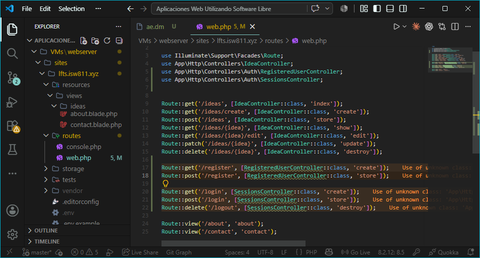
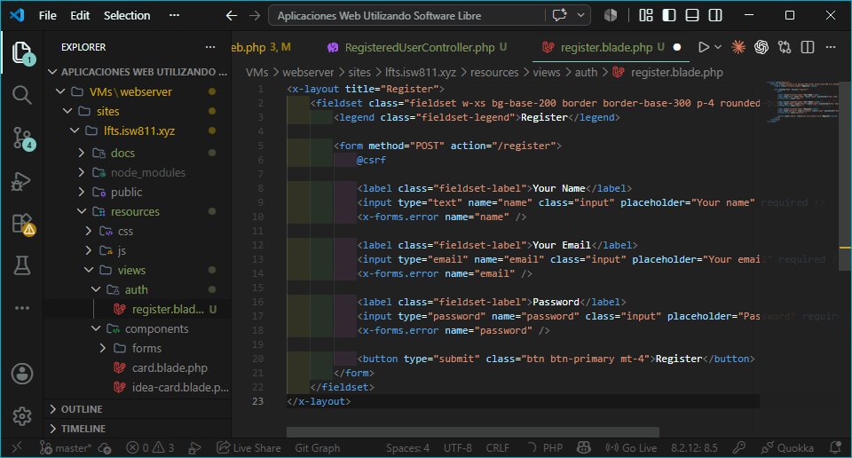
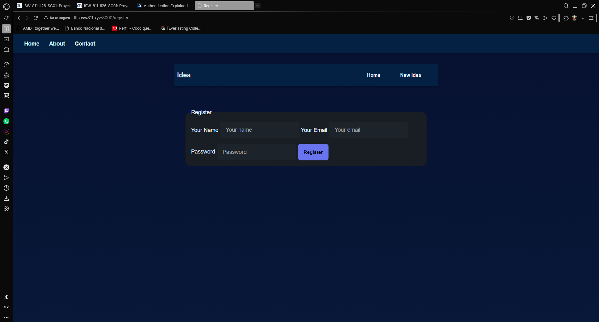
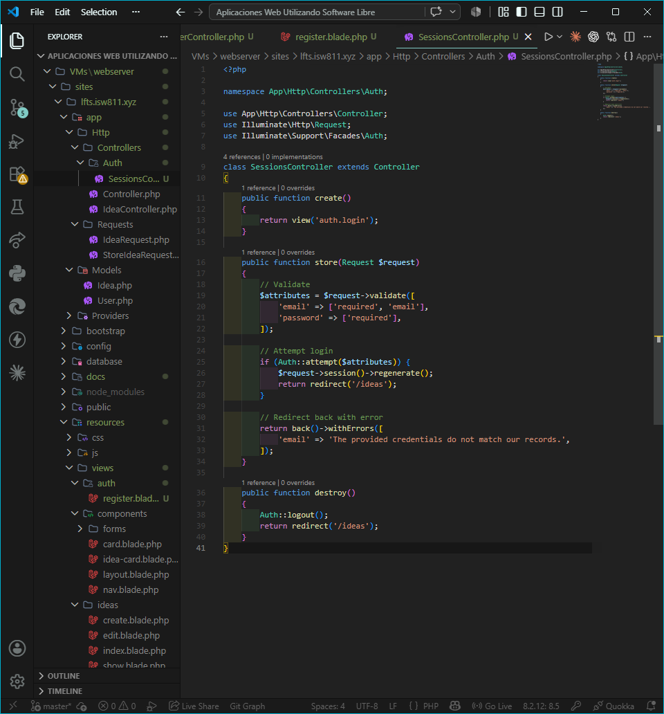
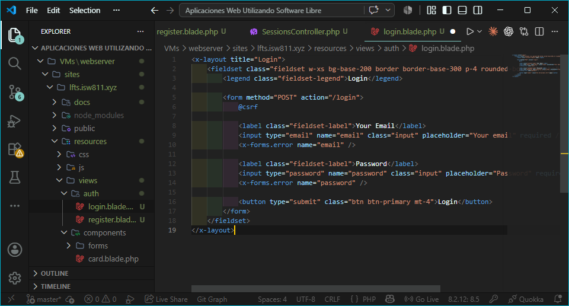
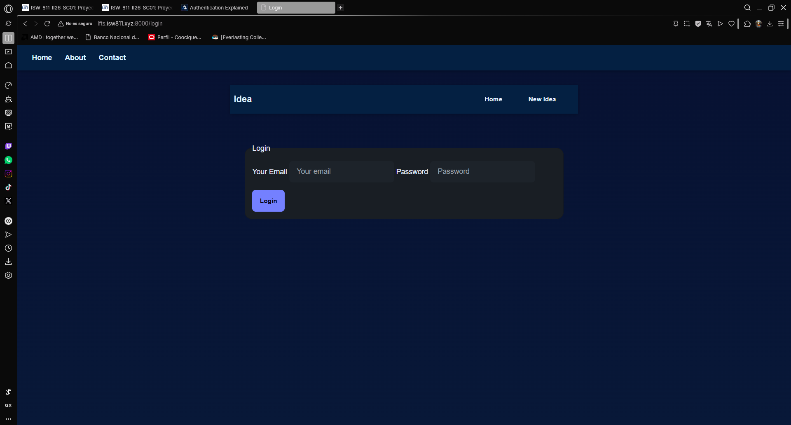
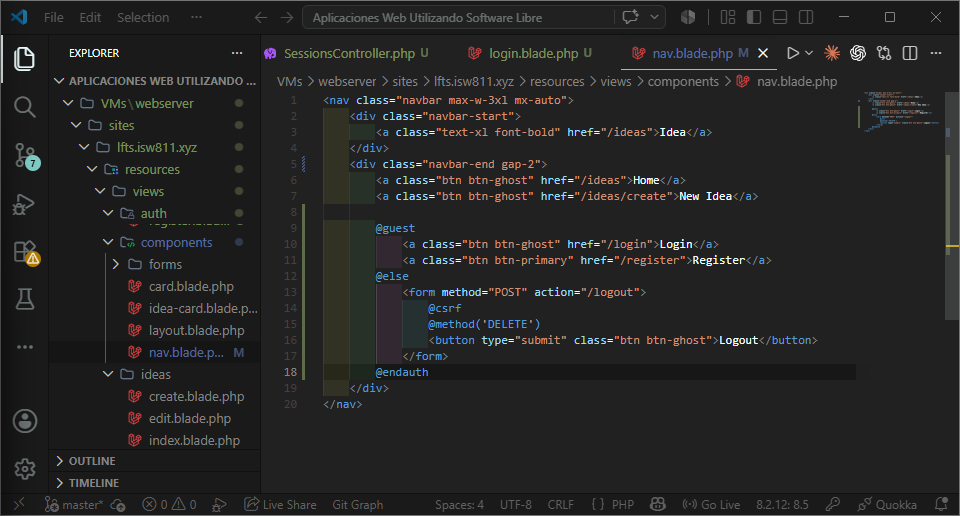
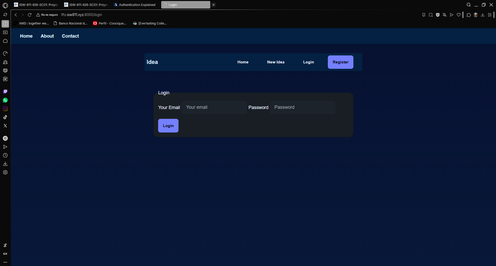
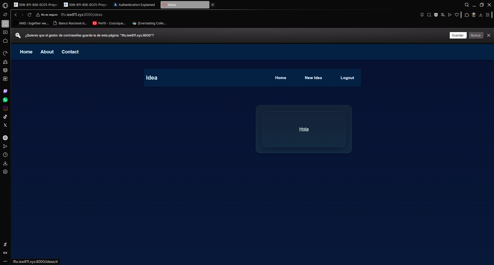

## Episodio 14: Authentication Explained

### Resumen
En este episodio implementé el sistema de autenticación de Laravel desde cero.
Se crearon controladores dedicados para el registro de usuarios y el manejo de
sesiones, con sus respectivas vistas y rutas. También se actualizó la navegación
para mostrar opciones diferentes según el estado de autenticación del usuario.

### Comandos utilizados
php artisan make:controller Auth/RegisteredUserController

php artisan make:controller Auth/SessionsController

### Archivos modificados
- routes/web.php
- app/Http/Controllers/Auth/RegisteredUserController.php
- app/Http/Controllers/Auth/SessionsController.php
- resources/views/auth/register.blade.php
- resources/views/auth/login.blade.php
- resources/views/components/nav.blade.php

### Evidencia

### Comentarios
Se implementó autenticación manual sin paquetes externos. Se comprendió el uso
de Auth::login(), Auth::attempt(), Auth::logout() y las directivas @guest y
@auth para controlar la navegación según el estado de sesión del usuario.