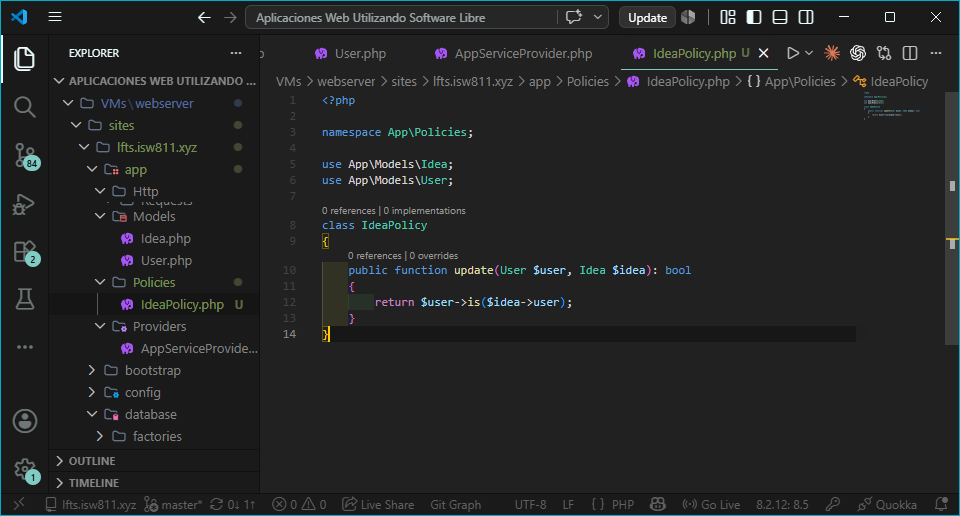
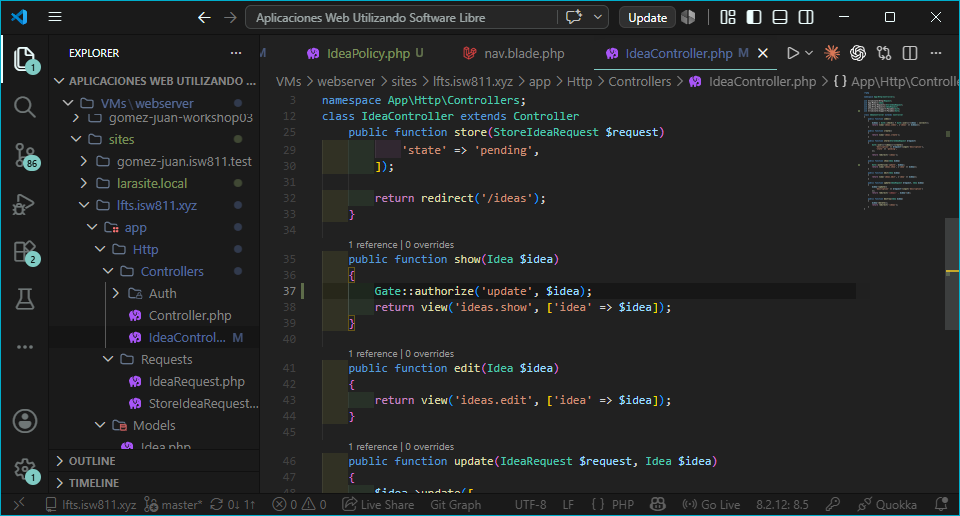
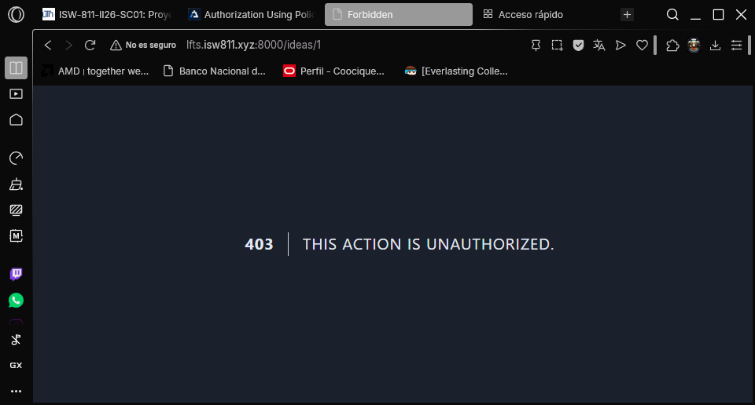
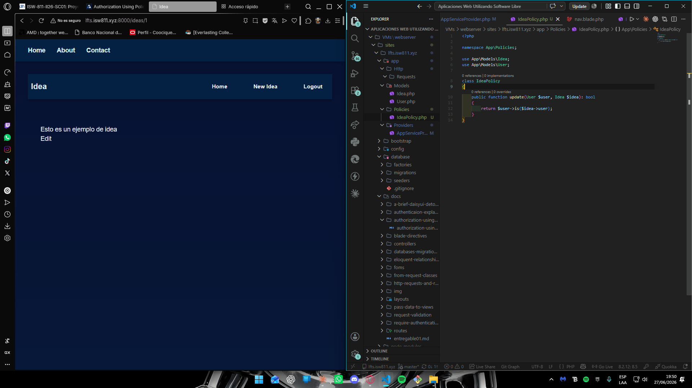

## Episodio 18: Authorization Using Policies

### Resumen
Se aprende a usar **Policies** de Laravel para autorización basada en modelos.
Se crea `IdeaPolicy` con el método `update` que verifica si el usuario autenticado
es el creador de la idea usando `$user->is($idea->user)`. Se aplica la autorización
en los métodos `show`, `edit`, `update` y `destroy` del `IdeaController` usando
`Gate::authorize()`. Se eliminan la ruta `/admin` y el Gate del episodio anterior
ya que eran solo ejemplos de demostración.

### Comandos utilizados
```bash
php artisan make:policy IdeaPolicy --model=Idea
```

### Archivos modificados
- `app/Policies/IdeaPolicy.php`
- `app/Http/Controllers/IdeaController.php`
- `app/Providers/AppServiceProvider.php`
- `routes/web.php`

### Evidencia





### Comentarios
Las Policies son el equivalente a los controladores para las reglas de autorización.
El método `$user->is($idea->user)` compara si dos modelos tienen el mismo ID y
pertenecen a la misma tabla, siendo una forma elegante de verificar la propiedad.
Laravel retorna 403 automaticamente cuando Gate::authorize falla.