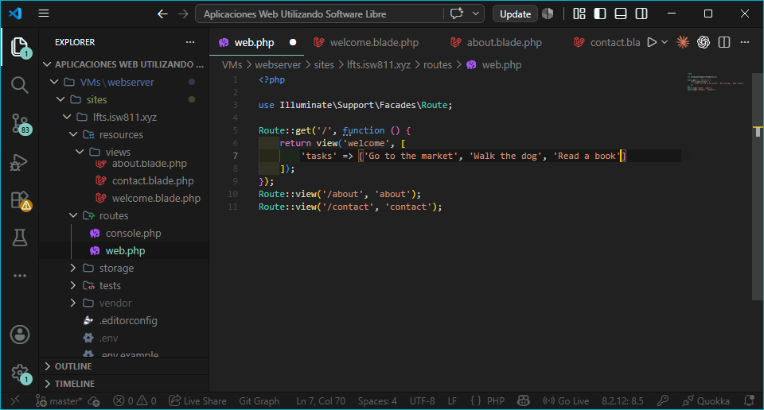
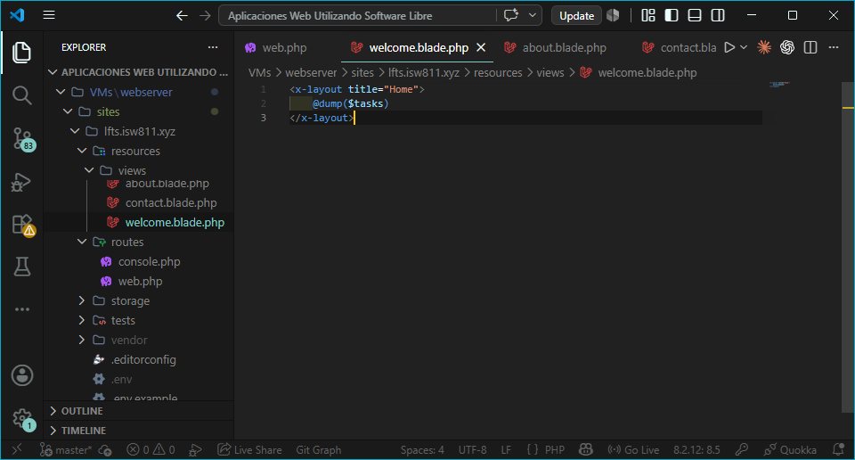
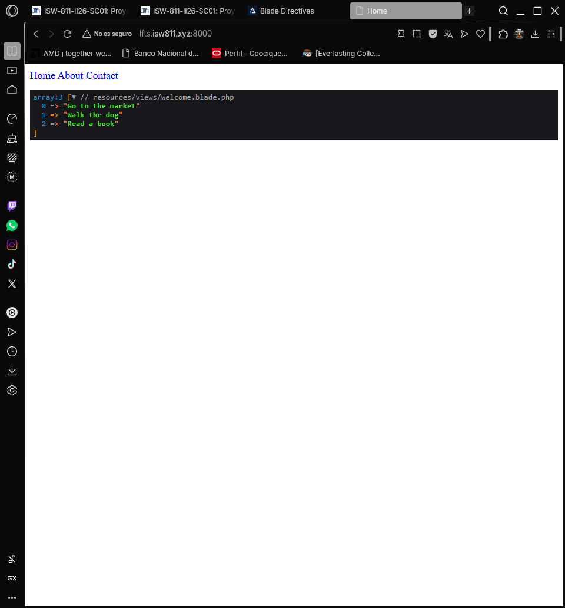
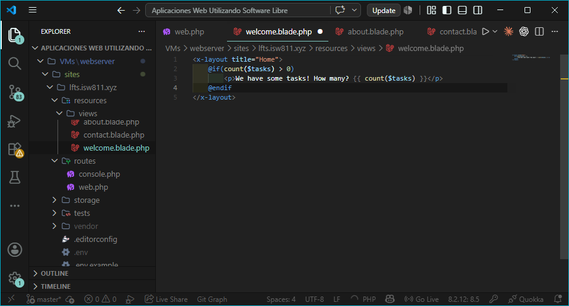
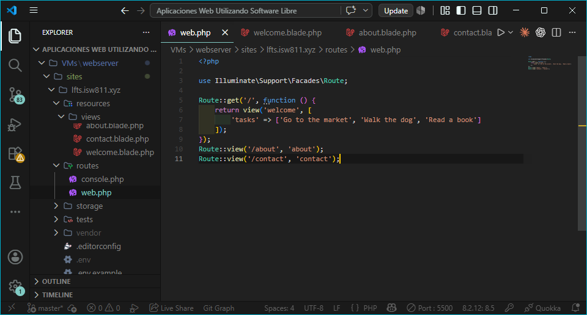
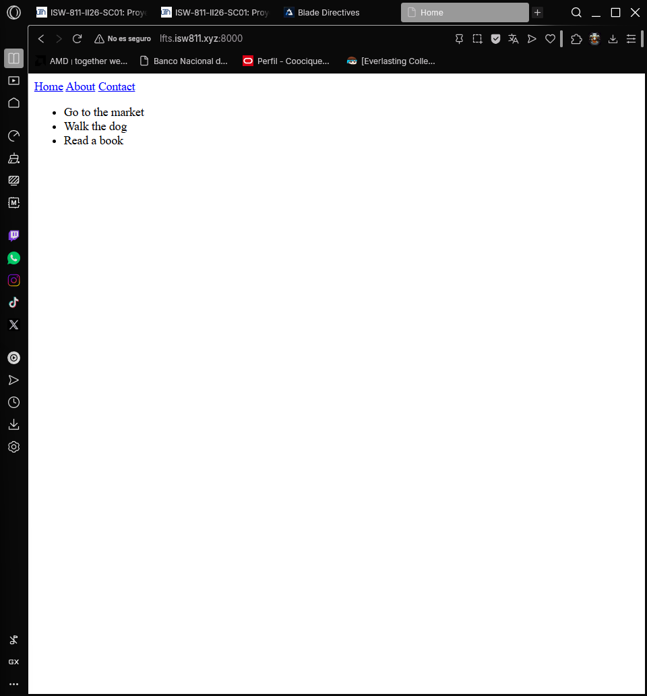
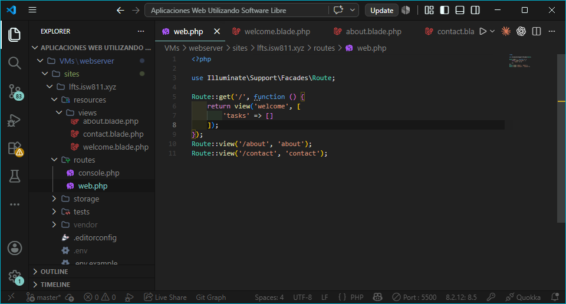
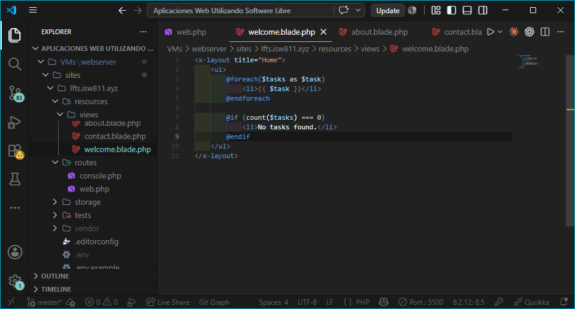
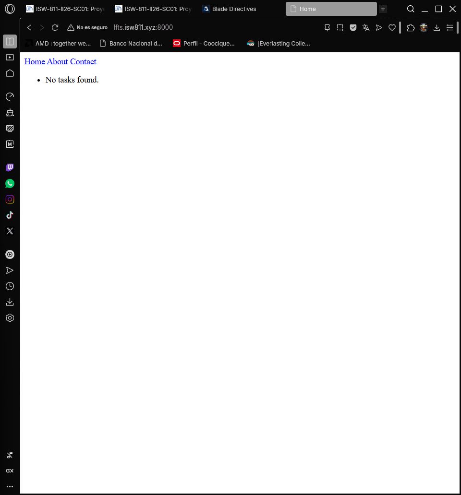

## Episodio 06: Blade Directives

### Resumen
En este episodio aprendí a usar las directivas de Blade para simplificar el código 
dentro de las vistas. Se exploraron directivas para depuración, condicionales y 
bucles, reemplazando la sintaxis PHP tradicional por una más limpia y legible.

### Actividades realizadas
- Pasé un array de tareas a la vista desde la ruta.
- Usé `@dump` para inspeccionar el contenido del array en pantalla.
- Usé `@if` para verificar si hay tareas disponibles.
- Usé `@foreach` para listar las tareas.
- Usé `@forelse` con `@empty` para manejar arrays vacíos.

### Comandos y código relevante

Array de tareas en la ruta:
```php
Route::get('/', function () {
    return view('welcome', [
        'tasks' => ['Go to the market', 'Walk the dog', 'Read a book']
    ]);
});
```

Depuración con @dump:
```php
@dump($tasks)
```

Condicional con @if:
```php
@if(count($tasks) > 0)
    <p>We have some tasks! How many? {{ count($tasks) }}</p>
@endif
```

Bucle con @foreach:
```php
@foreach($tasks as $task)
    <li>{{ $task }}</li>
@endforeach
```

Bucle con @forelse para arrays vacíos:
```php
@forelse($tasks as $task)
    <li>{{ $task }}</li>
@empty
    <li>No tasks found.</li>
@endforelse
```

### Archivos modificados
- `routes/web.php`
- `resources/views/welcome.blade.php`

### Lo que aprendí
- Las directivas Blade comienzan con el símbolo `@`.
- `@dump` muestra el contenido de una variable sin detener la ejecución.
- `@dd` muestra el contenido y detiene la ejecución.
- `@if` y `@endif` reemplazan los bloques condicionales de PHP.
- `@foreach` y `@endforeach` permiten iterar sobre arrays.
- `@forelse` combina el bucle con un caso para arrays vacíos mediante `@empty`.

### Evidencia









