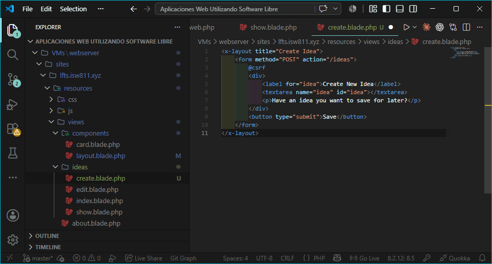
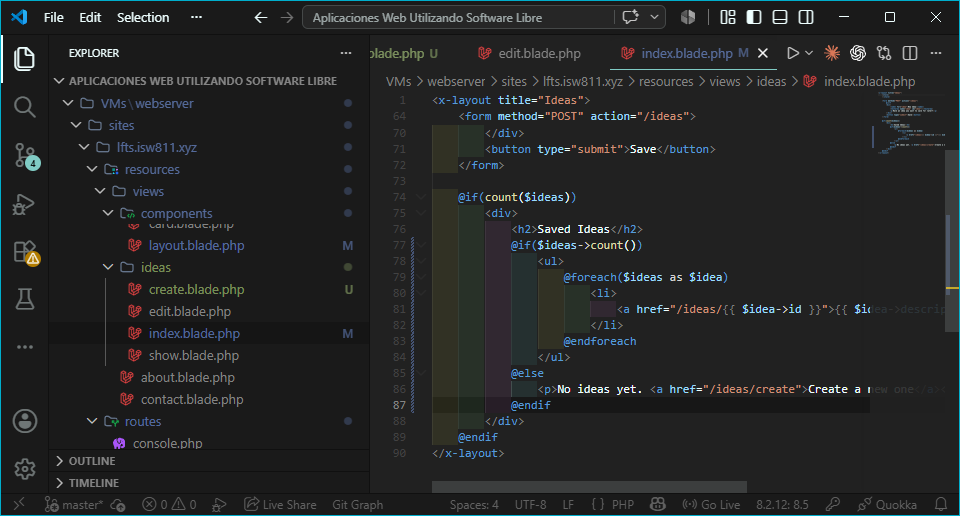
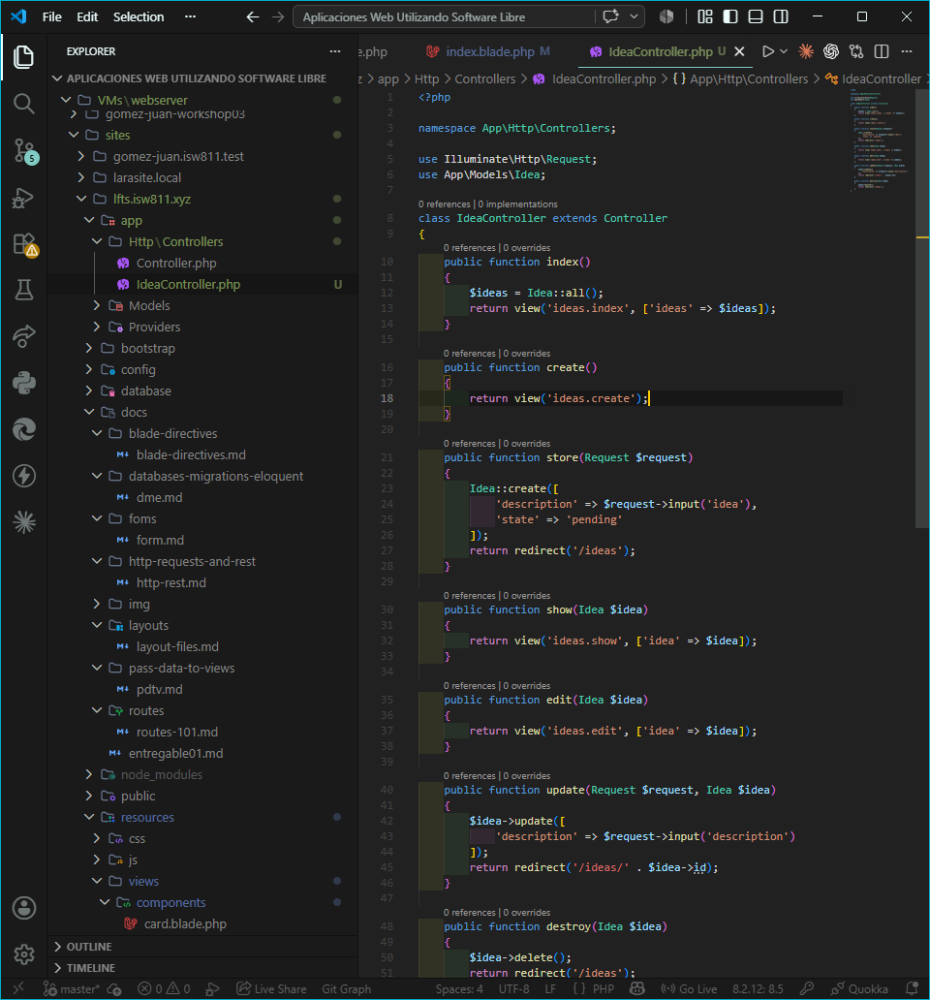
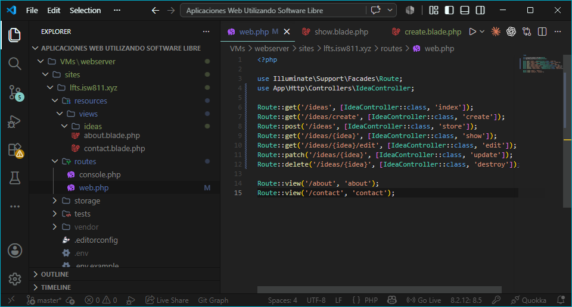
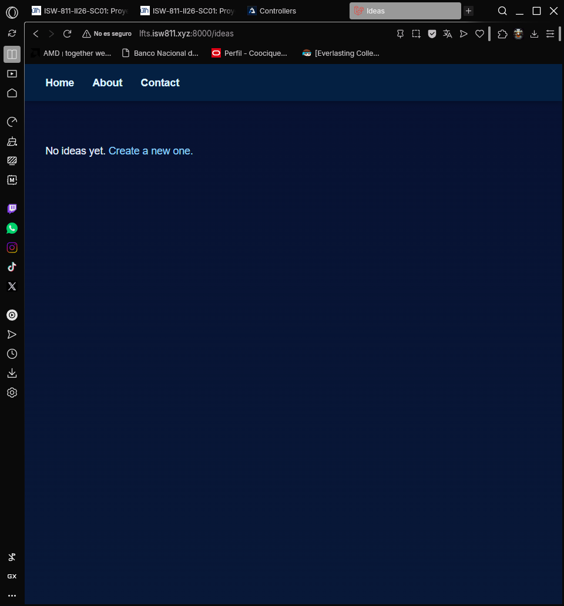
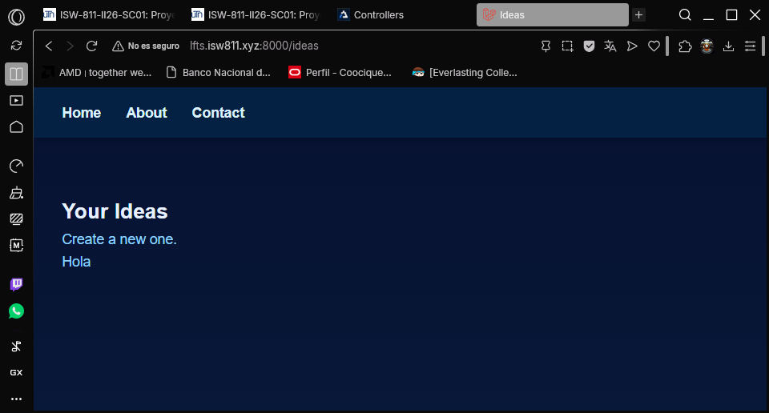
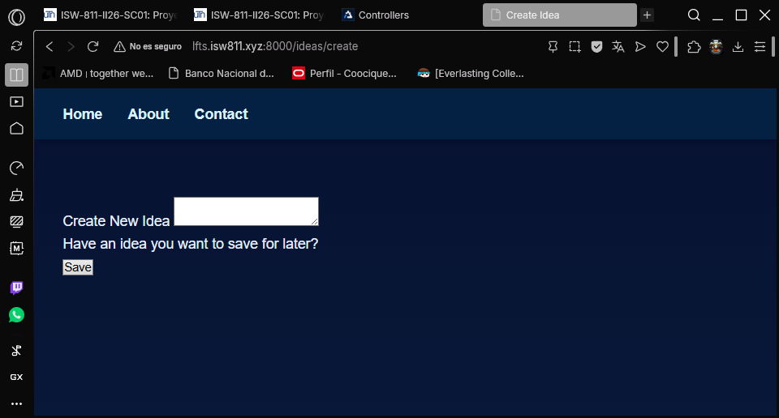

## Episodio 10: Controllers

### Resumen
En este episodio aprendí a usar controladores en Laravel para organizar la lógica 
de las rutas. Se creó el IdeaController con los siete métodos RESTful y se migró 
toda la lógica desde las closures en el archivo de rutas hacia el controlador.

### Actividades realizadas
- Creé la vista `ideas/create.blade.php` con el formulario para crear ideas.
- Agregué la acción `create` como séptima acción RESTful.
- Generé el controlador `IdeaController` con Artisan.
- Migré toda la lógica de las rutas al controlador.
- Actualicé `routes/web.php` para usar el controlador.
- Actualicé `ideas/index.blade.php` para manejar lista vacía con enlace a create.

### Comandos utilizados
```bash
php artisan make:controller IdeaController --resource --model=Idea
```

### Archivos modificados
- `app/Http/Controllers/IdeaController.php`
- `routes/web.php`
- `resources/views/ideas/index.blade.php`
- `resources/views/ideas/create.blade.php`
- `resources/views/components/layout.blade.php`

### Lo que aprendí
- Un controlador es una clase que agrupa las acciones que responden a las rutas.
- `php artisan make:controller` genera el archivo del controlador automáticamente.
- La opción `--resource` genera los siete métodos RESTful automáticamente.
- La opción `--model` configura el Route Model Binding automáticamente.
- Las siete acciones RESTful son: index, create, store, show, edit, update, destroy.
- Se referencian los métodos del controlador con `[IdeaController::class, 'método']`.

### Evidencia






