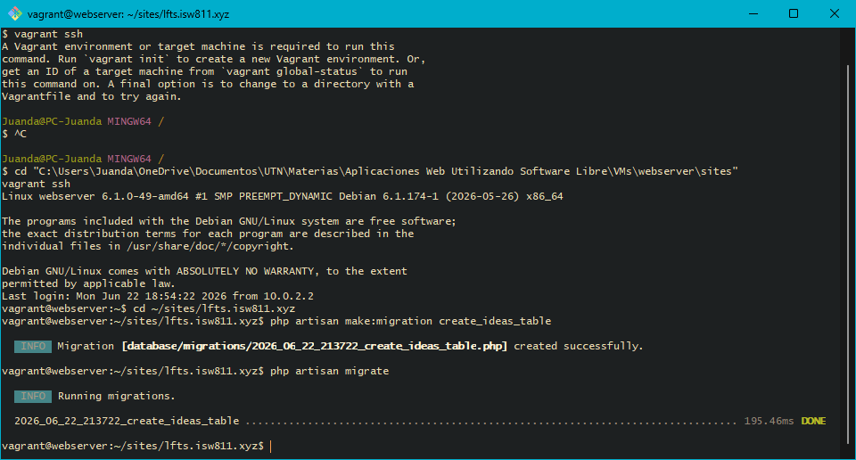
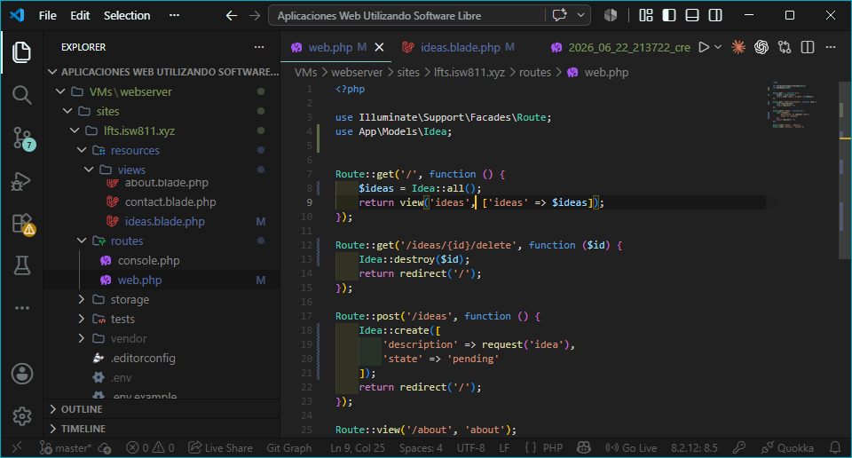
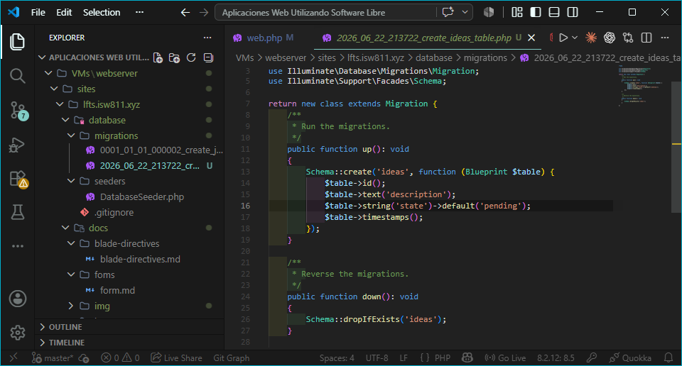
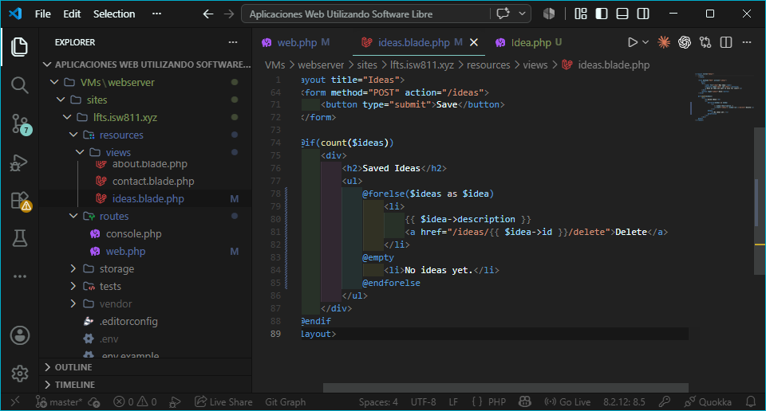
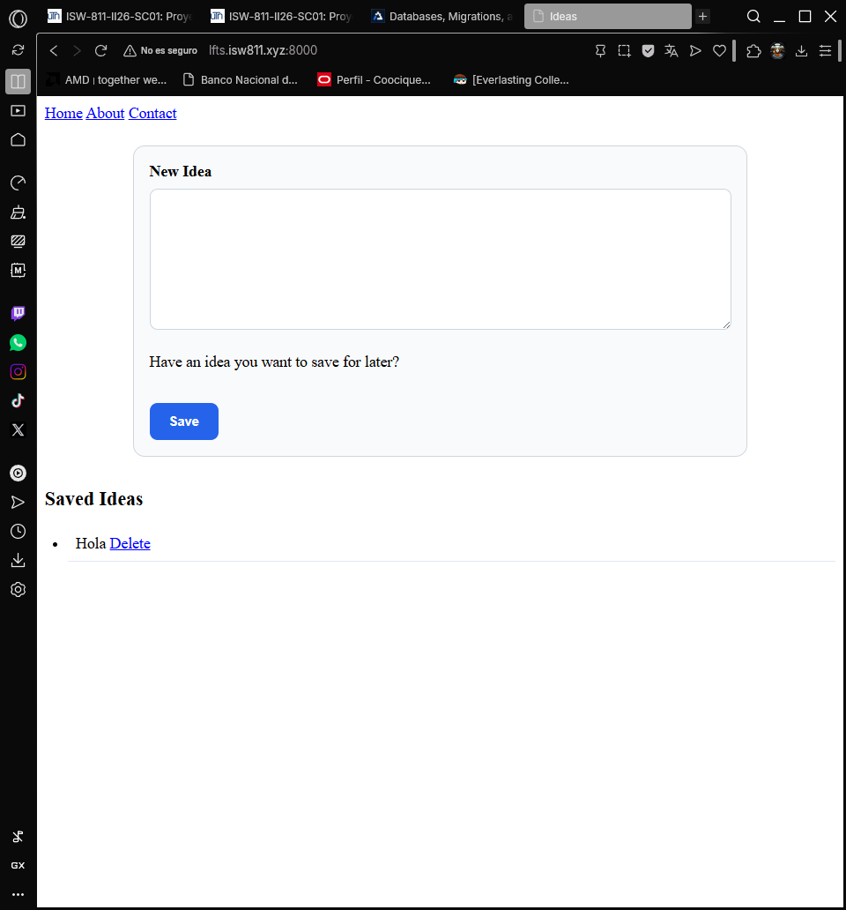
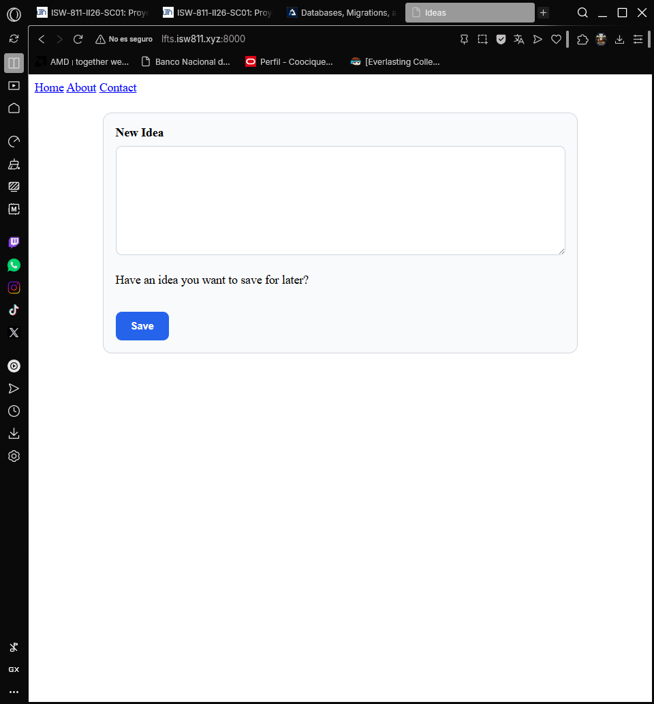

## Episodio 08: Databases, Migrations, and Eloquent

### Resumen
En este episodio aprendí a configurar una base de datos MariaDB en Laravel, crear 
migraciones para definir la estructura de las tablas y usar Eloquent ORM para 
interactuar con la base de datos de forma orientada a objetos. También se implementó
la funcionalidad de eliminar ideas individuales.

### Actividades realizadas
- Configuré la conexión a MariaDB en el archivo `.env`.
- Creé la migración `create_ideas_table` con columnas `description`, `state` y `timestamps`.
- Ejecuté `php artisan migrate` para crear la tabla en la base de datos.
- Ejecuté `php artisan migrate:refresh` para resetear y volver a correr las migraciones.
- Creé el modelo Eloquent `Idea` y desactivé el guarded con `$guarded = []`.
- Actualicé las rutas para usar `Idea::all()`, `Idea::create()` y `Idea::destroy()`.
- Actualicé la vista para mostrar `$idea->description` y el enlace de eliminar.

### Comandos utilizados
```bash
php artisan make:migration create_ideas_table
php artisan migrate
php artisan migrate:refresh
php artisan make:model Idea
```

### Archivos modificados
- `.env`
- `database/migrations/2026_06_22_213722_create_ideas_table.php`
- `app/Models/Idea.php`
- `routes/web.php`
- `resources/views/ideas.blade.php`

### Lo que aprendí
- Las migraciones funcionan como control de versiones para la base de datos.
- `php artisan migrate` ejecuta todas las migraciones pendientes.
- `php artisan migrate:refresh` resetea y vuelve a correr todas las migraciones.
- Eloquent permite interactuar con la base de datos usando modelos orientados a objetos.
- `Idea::all()` retorna todos los registros de la tabla ideas.
- `Idea::create()` inserta un nuevo registro en la tabla.
- `Idea::destroy($id)` elimina un registro por el ID.
- `$guarded = []` desactiva la protección de atributos en el modelo.

### Evidencia





