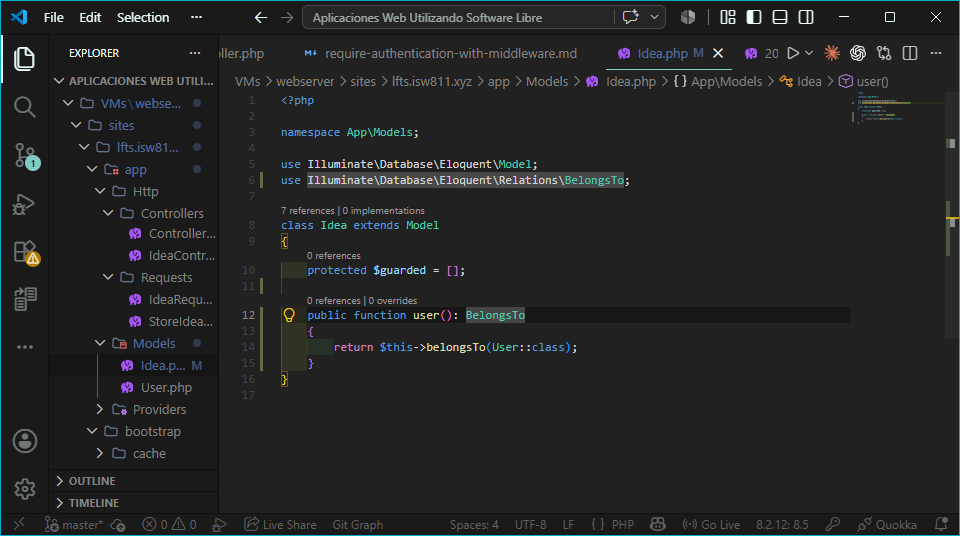
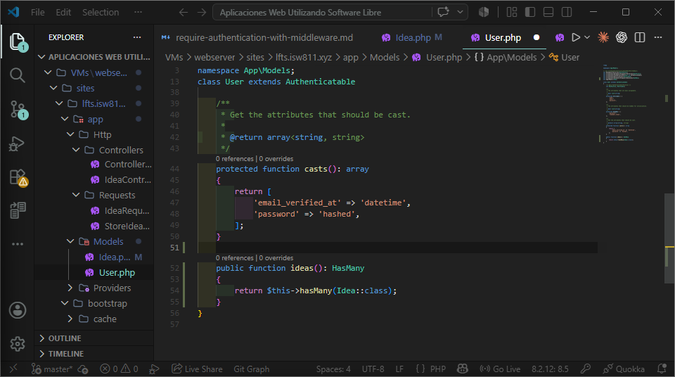
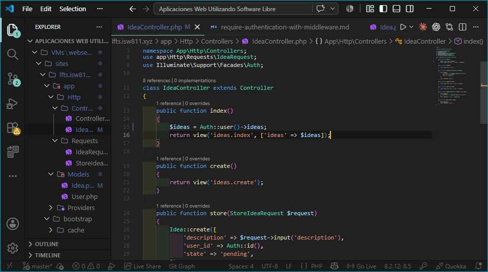
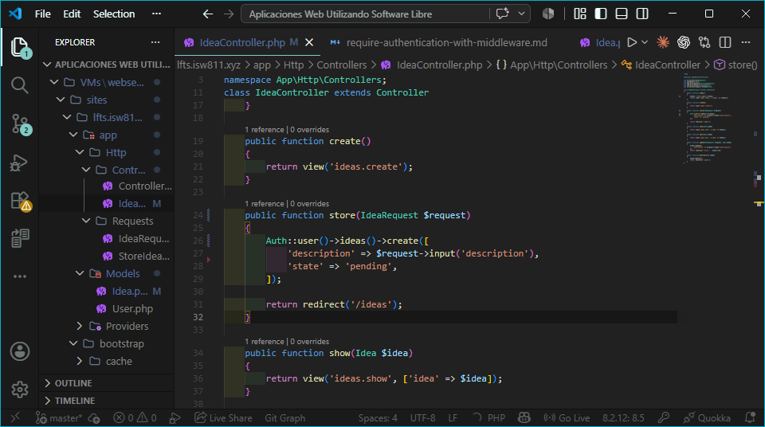
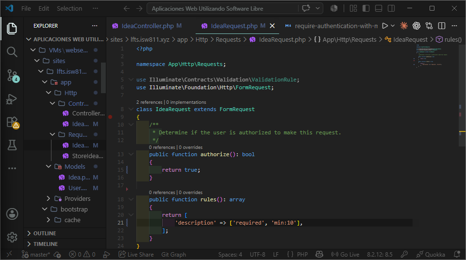
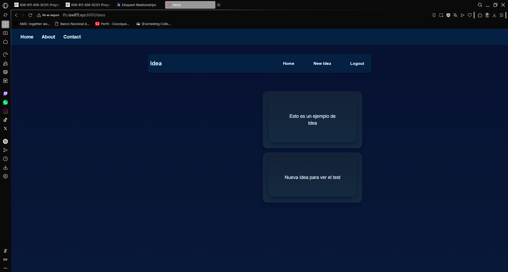

## Episodio 16: Eloquent Relationships

### Resumen
En este episodio definí las relaciones entre los modelos Idea y User usando
Eloquent. Se refactorizó el controlador para aprovechar estas relaciones y
simplificar las consultas a la base de datos.

### Archivos modificados
- app/Models/Idea.php
- app/Models/User.php
- app/Http/Controllers/IdeaController.php
- app/Http/Requests/IdeaRequest.php

### Evidencia

### Comentarios
Se comprendió la diferencia entre belongsTo y hasMany en Eloquent. Se aprendió
a acceder a relaciones como propiedad ($idea->user) y como método ($user->ideas())
para construir queries. Se simplificó el código del controlador usando las
relaciones en lugar de queries manuales con where().