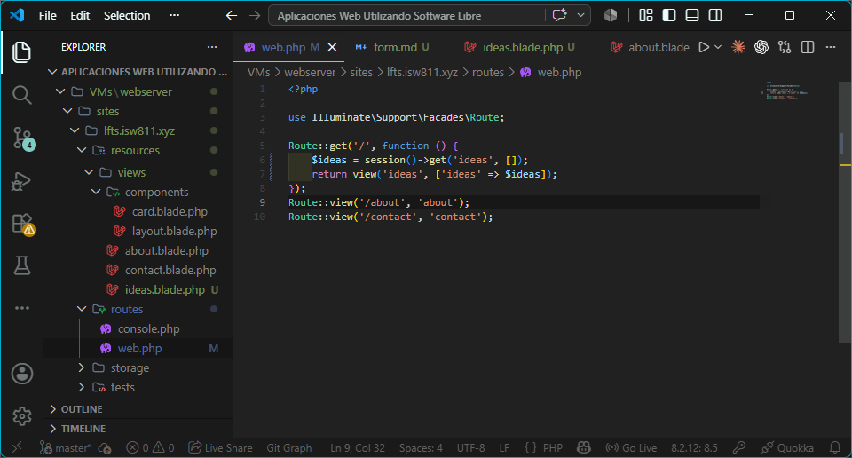
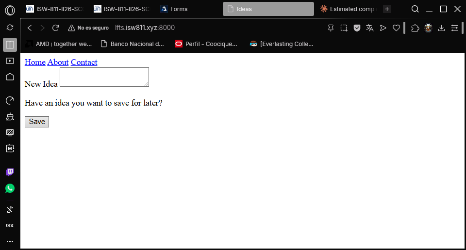
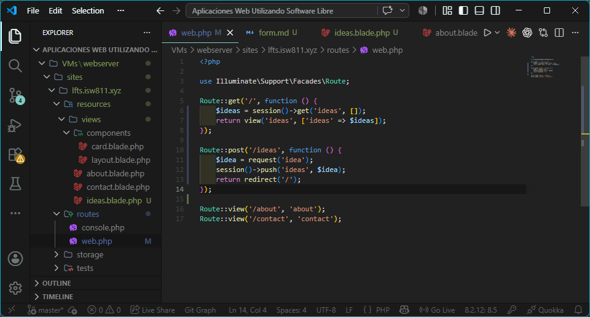
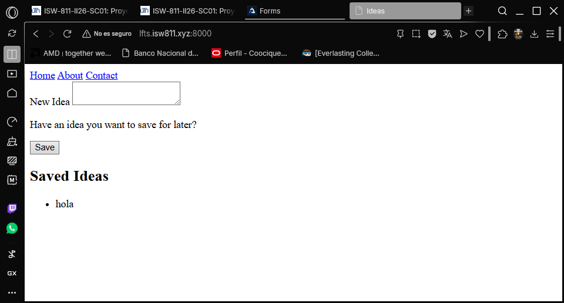
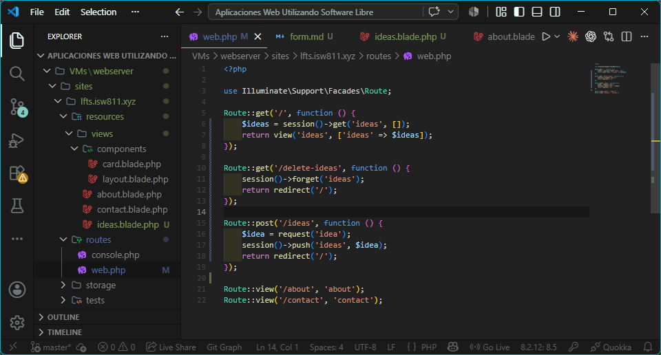
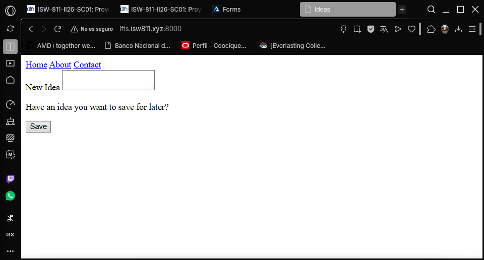
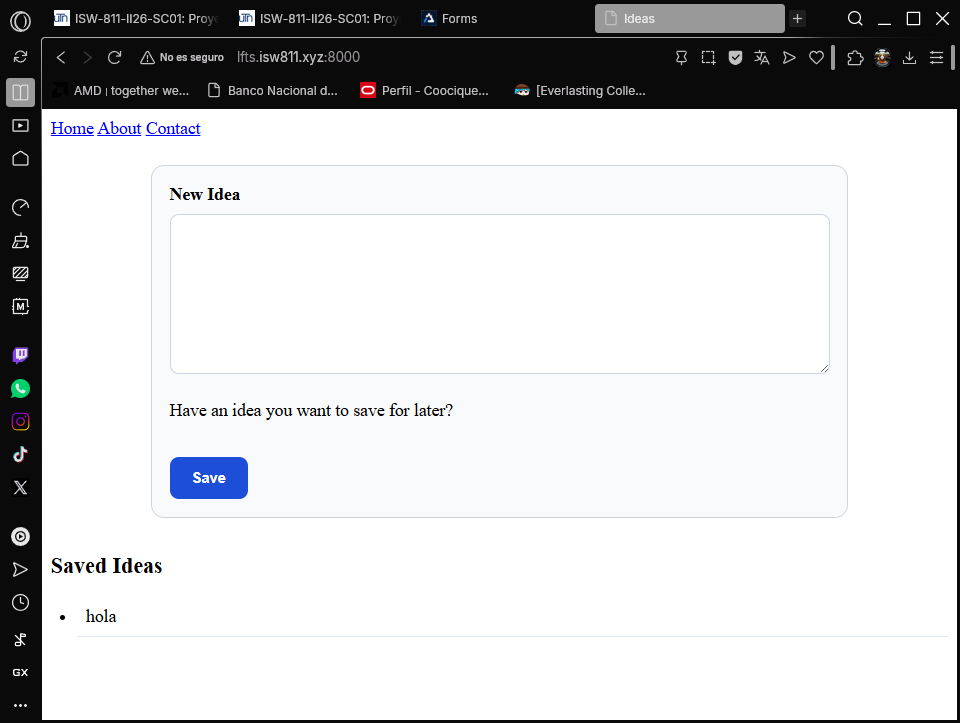

## Episodio 07: Forms

### Resumen
En este episodio aprendí a crear y procesar formularios en Laravel. Se implementó 
un formulario POST para guardar ideas, se explicó la protección CSRF y se usó 
la sesión para persistir temporalmente los datos del usuario.

### Actividades realizadas
- Renombré la vista `welcome` a `ideas` y actualicé la ruta correspondiente.
- Creé un formulario POST con el campo `textarea` para ingresar ideas.
- Implementé la protección CSRF con la directiva `@csrf`.
- Guardé las ideas en la sesión con `session()->push()`.
- Redirigí al usuario al home después de enviar el formulario.
- Agregué una ruta temporal para limpiar la sesión con `session()->forget()`.
- Mostré las ideas guardadas en la vista usando `@forelse`.

### Comandos y código relevante

Ruta GET para cargar ideas desde la sesión:
```php
Route::get('/', function () {
    $ideas = session()->get('ideas', []);
    return view('ideas', ['ideas' => $ideas]);
});
```

Ruta POST para guardar ideas en la sesión:
```php
Route::post('/ideas', function () {
    $idea = request('idea');
    session()->push('ideas', $idea);
    return redirect('/');
});
```

Ruta temporal para limpiar la sesión:
```php
Route::get('/delete-ideas', function () {
    session()->forget('ideas');
    return redirect('/');
});
```

Directiva CSRF en el formulario:
```php
@csrf
```

### Archivos modificados
- `routes/web.php`
- `resources/views/ideas.blade.php`

### Lo que aprendí
- Los formularios POST requieren el token CSRF para protegerse contra ataques.
- `@csrf` genera automáticamente un campo oculto con el token de seguridad.
- `session()->push()` agrega un elemento a un array en la sesión.
- `session()->get()` recupera datos de la sesión con un valor por defecto.
- `session()->forget()` elimina un valor de la sesión.
- Sin registrar una ruta POST, el servidor devuelve un error 404.
- El error 419 indica que el token CSRF no fue incluido o expiró.

### Evidencia






