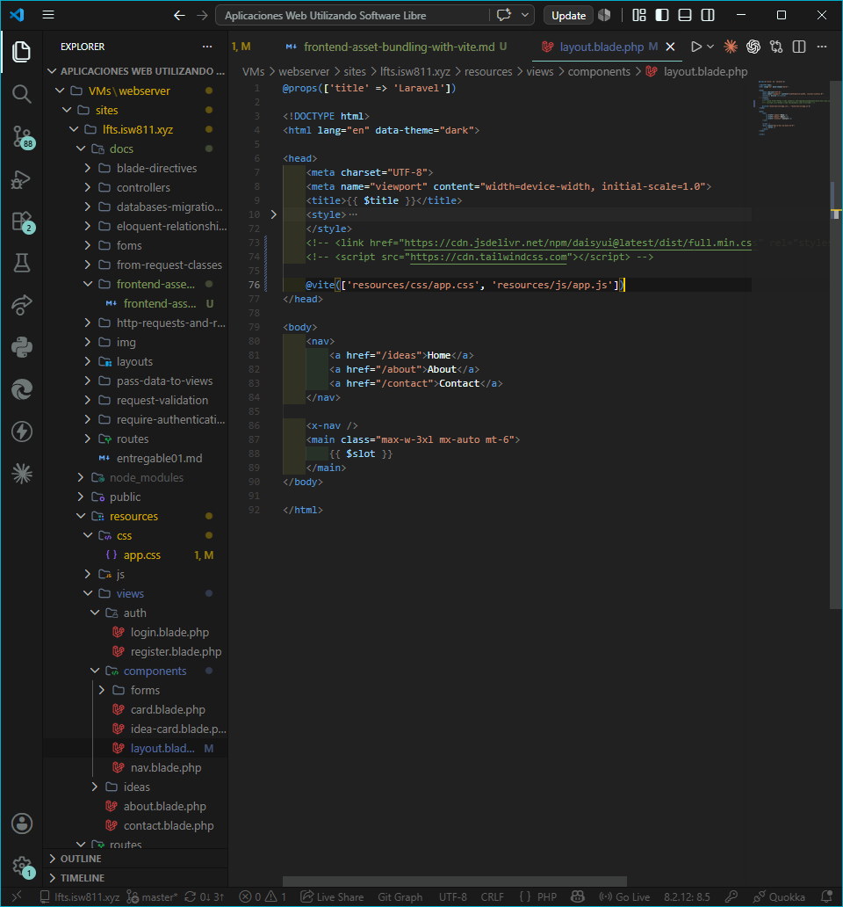
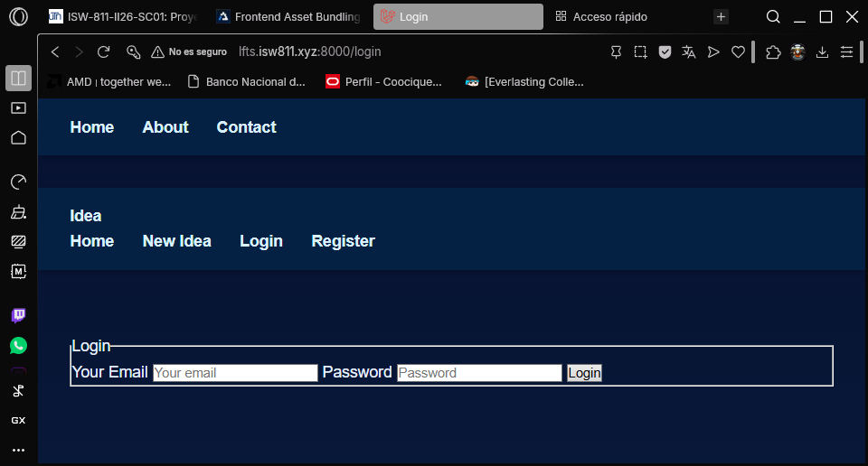
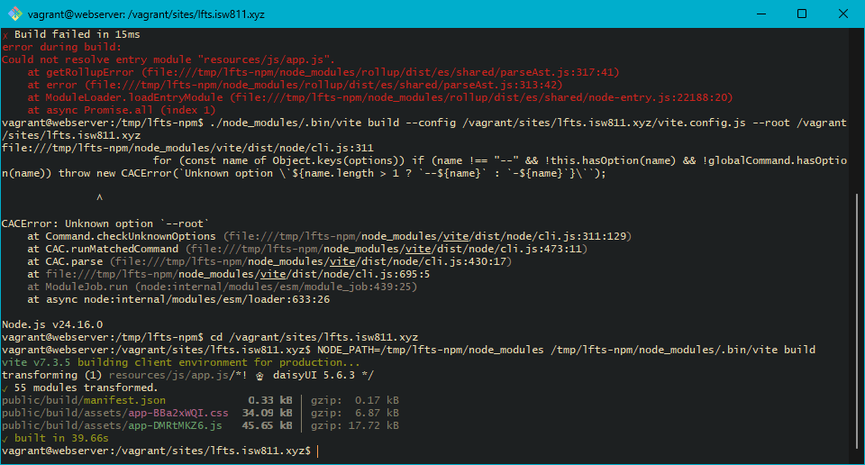
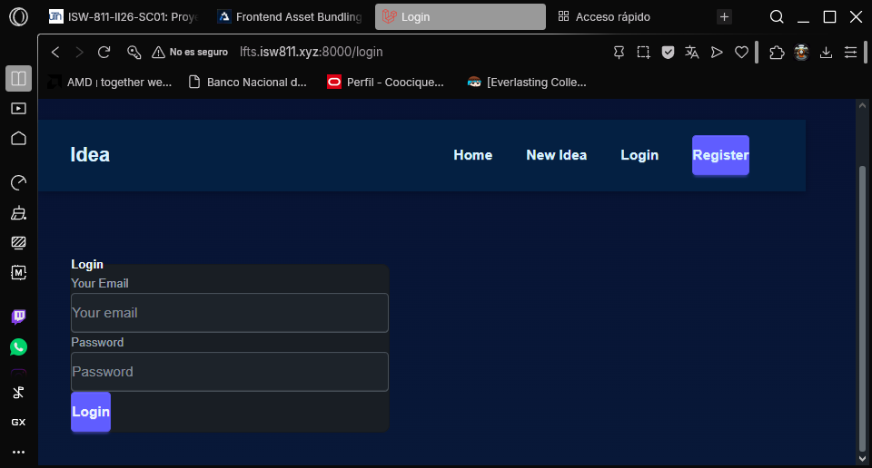
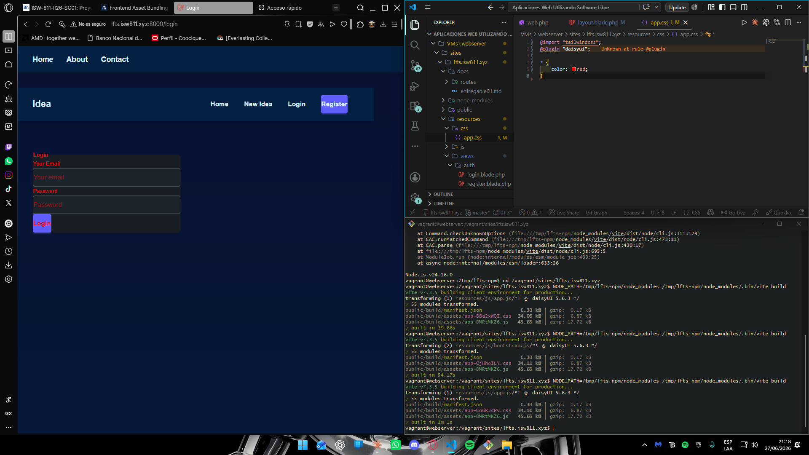

## Episodio 19: Frontend Asset Bundling with Vite

### Resumen
Se migra de CDN a bundling local usando **Vite**. Se remueven las referencias
a Tailwind CSS y DaisyUI desde CDN en el layout, se instalan localmente con npm,
se configura `app.css` con las directivas correspondientes y se agrega la
directiva `@vite` al layout. Se verifica el cambio de estilos en desarrollo
y se genera el build optimizado para producción.

### Comandos utilizados
```bash
npm install --no-bin-links
npm install daisyui@latest --no-bin-links

# Correr servidor dev
NODE_PATH=/tmp/lfts-npm/node_modules /tmp/lfts-npm/node_modules/.bin/vite

# Build para produccion
NODE_PATH=/tmp/lfts-npm/node_modules /tmp/lfts-npm/node_modules/.bin/vite build
```

### Archivos modificados
- `resources/views/components/layout.blade.php`
- `resources/css/app.css`

### Evidencia






### Comentarios
En entornos Vagrant con carpetas compartidas de Windows, npm install requiere
el flag --no-bin-links para evitar errores de symlinks. El hot reload de Vite
no funciona en este entorno por la misma razon, por lo que se debe correr
el build manualmente tras cada cambio de CSS o JS con el comando NODE_PATH.
El warning "Unknown at rule @plugin" en VS Code es solo un problema de
IntelliSense y no afecta el funcionamiento del proyecto.