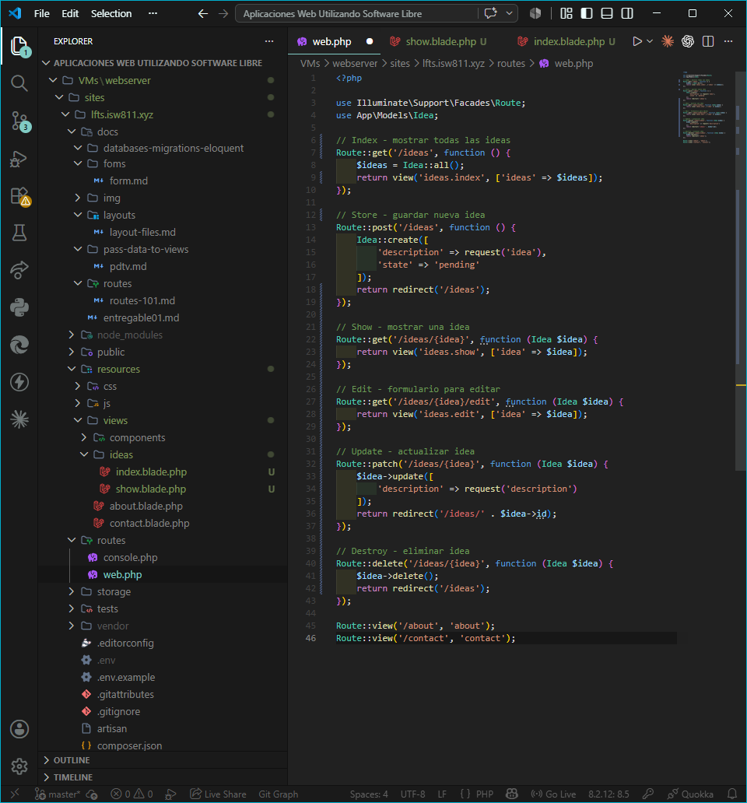
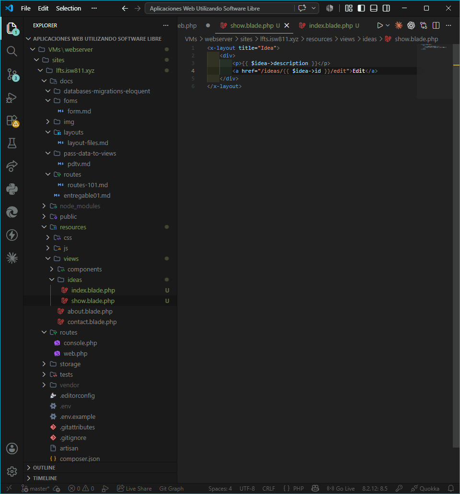
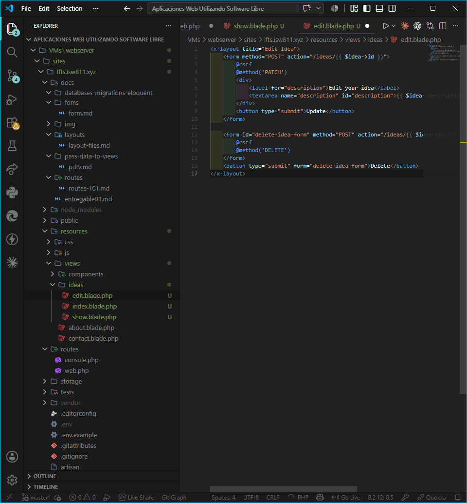
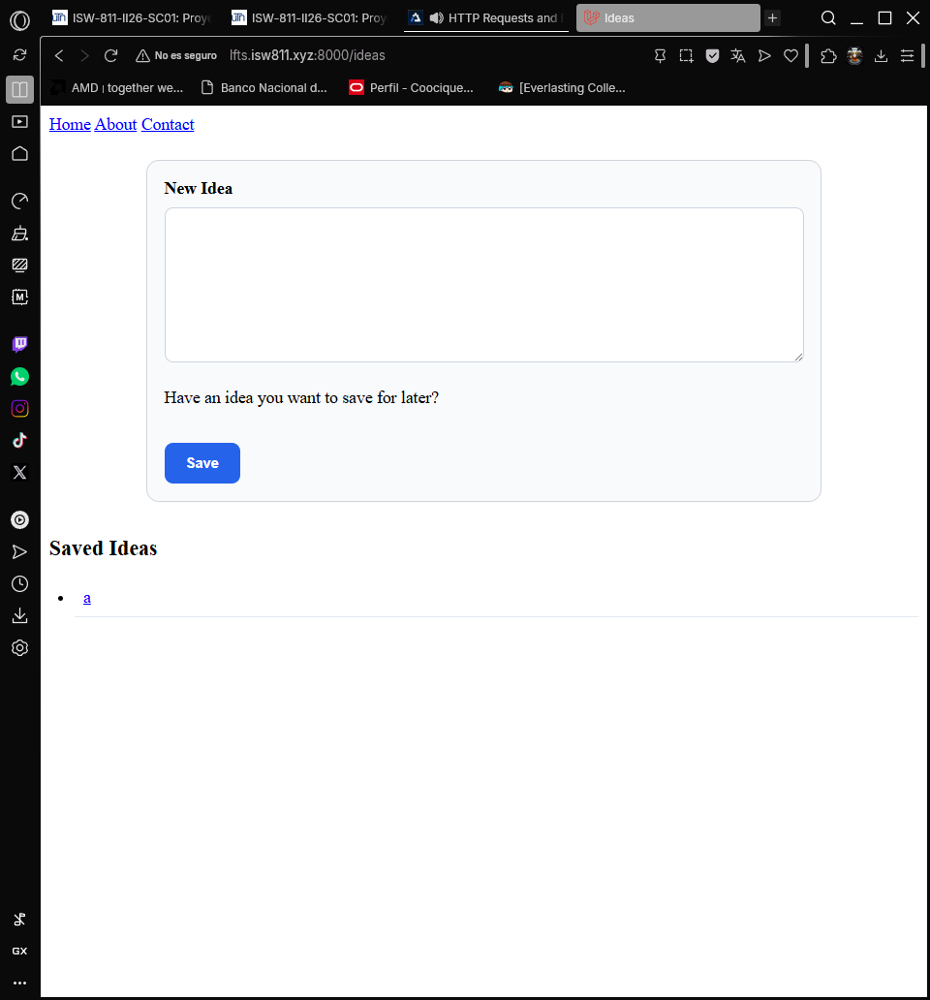
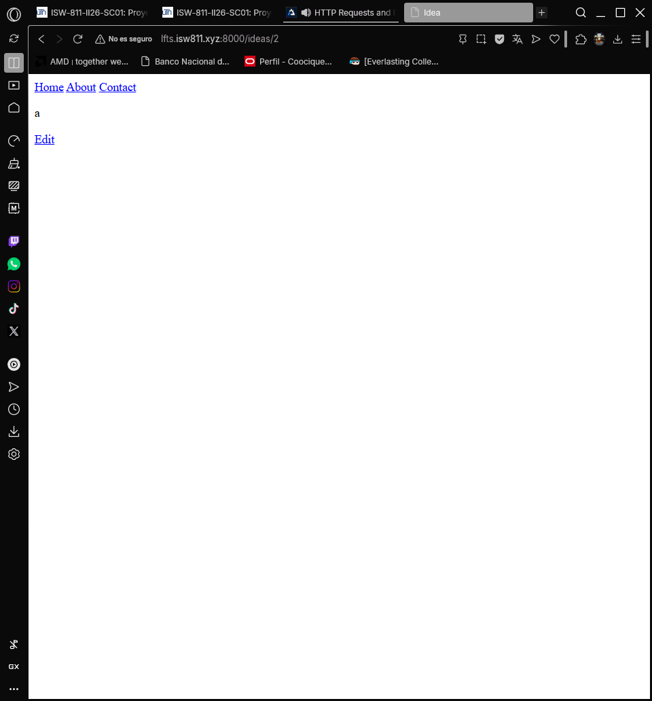
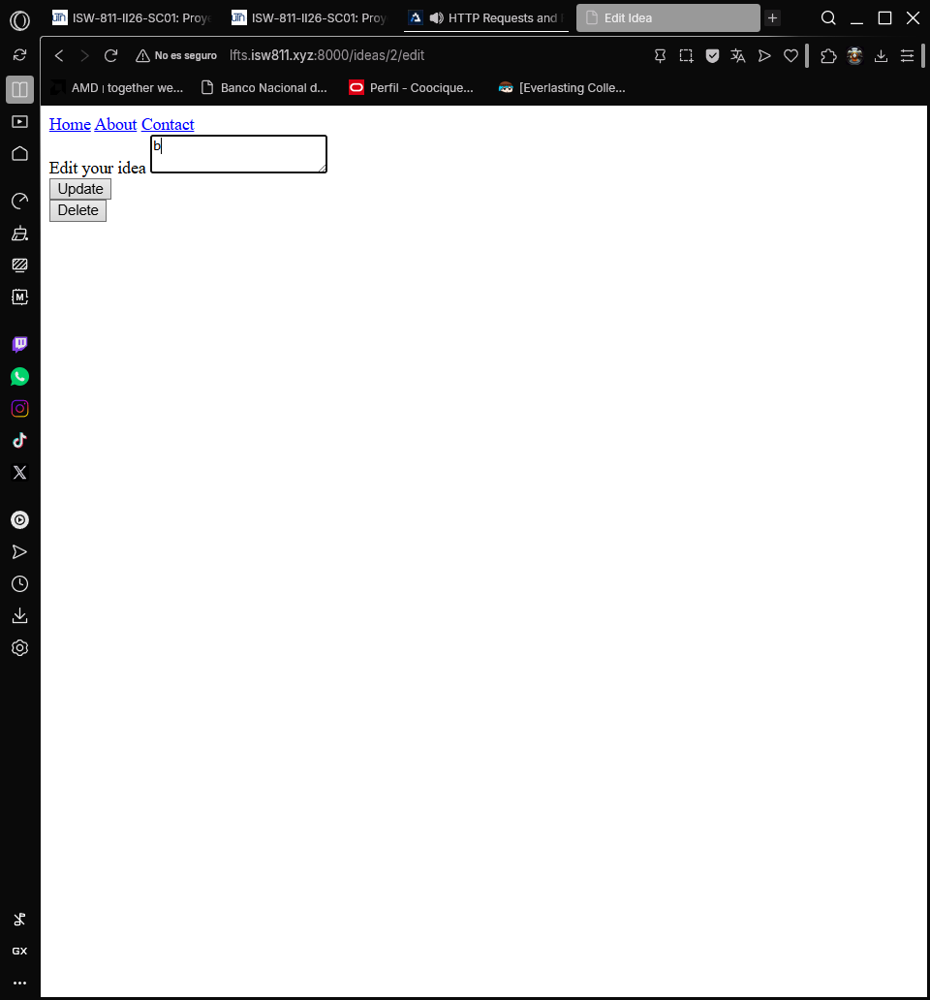

## Episodio 09: HTTP Requests and REST

### Resumen
En este episodio aprendí a estructurar rutas siguiendo los principios REST en Laravel.
Se implementaron las operaciones CRUD completas para el recurso ideas, usando Route 
Model Binding, method spoofing y las convenciones de nomenclatura de acciones REST.

### Actividades realizadas
- Reorganicé las vistas en una carpeta `ideas/` con archivos `index`, `show` y `edit`.
- Implementé rutas RESTful para index, store, show, edit, update y destroy.
- Usé Route Model Binding para obtener automáticamente el modelo por ID.
- Implementé method spoofing con `@method('PATCH')` y `@method('DELETE')`.
- Agregué enlaces en el index para navegar a la vista show de cada idea.
- Implementé el formulario de edición con actualización en la base de datos.
- Implementé la eliminación de ideas con un formulario DELETE separado.

### Comandos y código relevante

Rutas RESTful:
```php
Route::get('/ideas', function () { ... });          // Index
Route::post('/ideas', function () { ... });         // Store
Route::get('/ideas/{idea}', function (Idea $idea) { ... });        // Show
Route::get('/ideas/{idea}/edit', function (Idea $idea) { ... });   // Edit
Route::patch('/ideas/{idea}', function (Idea $idea) { ... });      // Update
Route::delete('/ideas/{idea}', function (Idea $idea) { ... });     // Destroy
```

Method spoofing en formulario:
```html
@method('PATCH')
@method('DELETE')
```

### Archivos modificados
- `routes/web.php`
- `resources/views/ideas/index.blade.php`
- `resources/views/ideas/show.blade.php`
- `resources/views/ideas/edit.blade.php`
- `resources/views/components/layout.blade.php`

### Lo que aprendí
- REST mapea los verbos HTTP a operaciones CRUD.
- Route Model Binding permite obtener automáticamente un modelo por su ID.
- `findOrFail()` retorna 404 automáticamente si no encuentra el registro.
- Los navegadores solo soportan GET y POST, por eso se usa method spoofing.
- `@method('PATCH')` y `@method('DELETE')` generan un campo oculto para simular el método.
- Las acciones REST se nombran: index, store, show, edit, update, destroy.

### Evidencia






