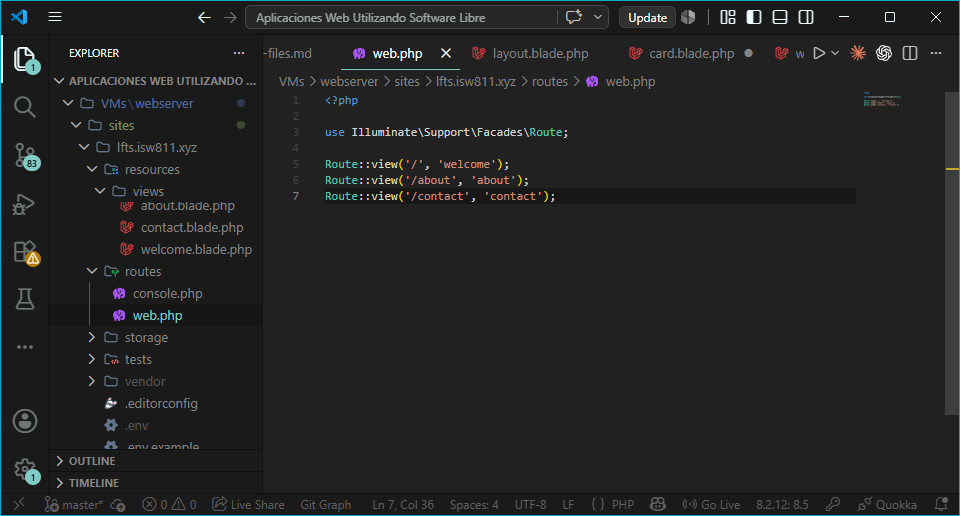
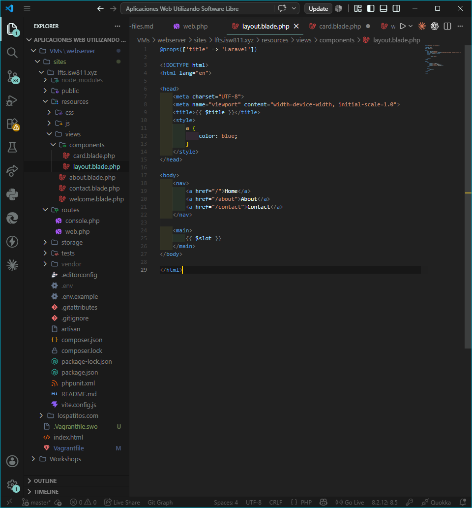
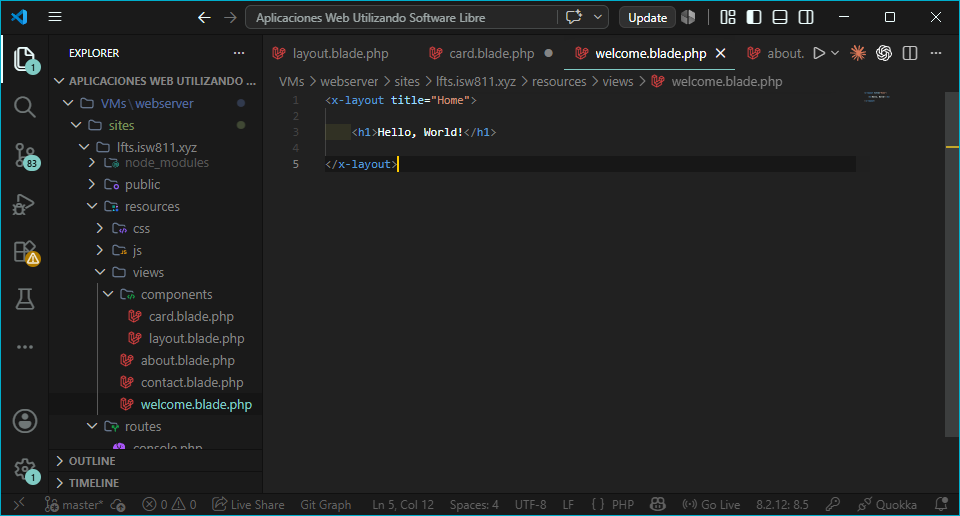
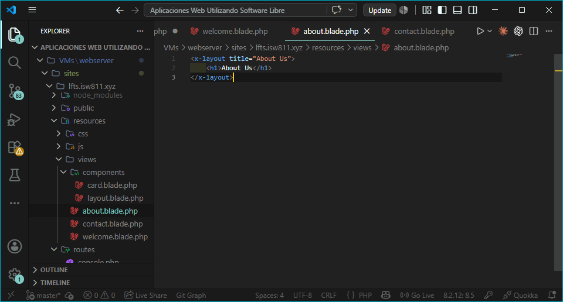
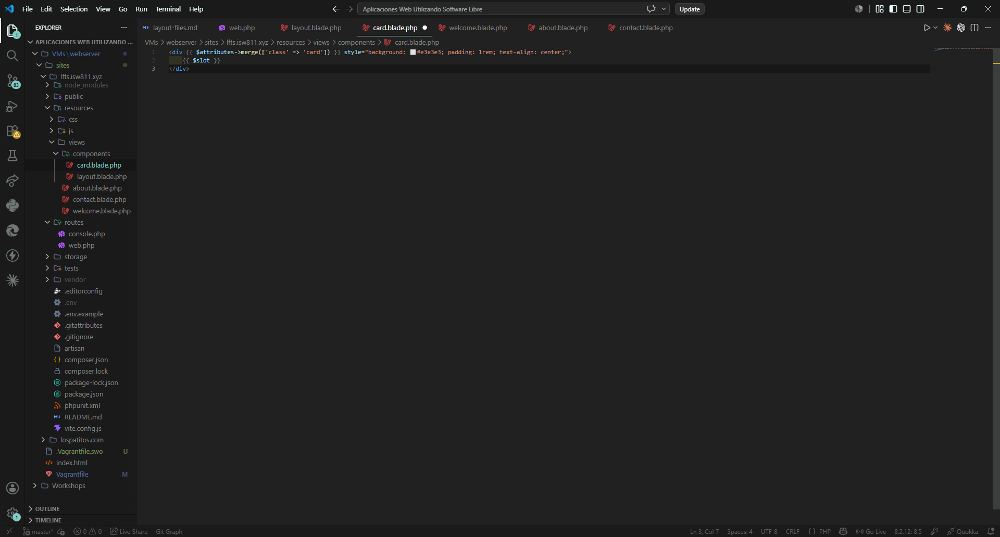
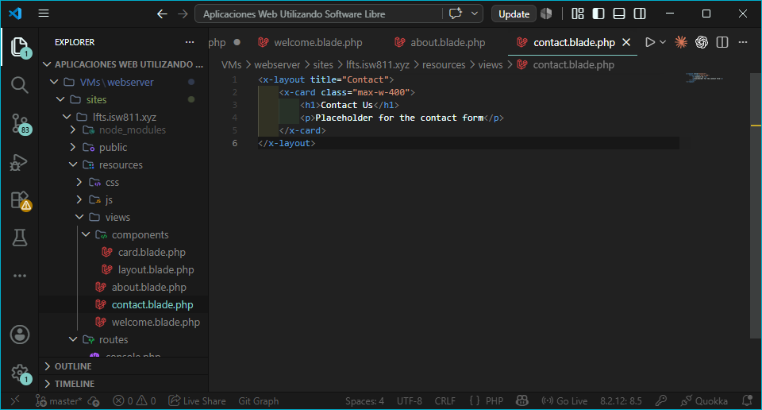

## Episodio 04: Layout Files

### Resumen
En este episodio aprendí a crear archivos de layout en Laravel para evitar la duplicación 
de código HTML entre vistas. Se utilizó el sistema de componentes de Blade para crear un 
layout reutilizable y un componente de tarjeta.

### Actividades realizadas
- Usé `Route::view()` como shorthand para simplificar las rutas.
- Creé la carpeta `components` dentro de `resources/views/`.
- Creé el componente `layout.blade.php` con soporte de props y slot.
- Actualicé las vistas `welcome`, `about` y `contact` para usar `x-layout`.
- Creé el componente `card.blade.php` con merge de atributos.
- Usé el componente `x-card` dentro de la vista `contact`.

### Comandos y código relevante

Shorthand de rutas:
```php
Route::view('/', 'welcome')->name('home');
Route::view('/about', 'about')->name('about');
Route::view('/contact', 'contact')->name('contact');
```

Componente layout con prop title:
```php
@props(['title' => 'Laravel'])
```

Uso del layout en una vista:
```html
<x-layout title="Home">
    <h1>Hello, World!</h1>
</x-layout>
```

Merge de atributos en card:
```html
<div {{ $attributes->merge(['class' => 'card']) }} style="background: #e3e3e3; padding: 1rem; text-align: center;">
    {{ $slot }}
</div>
```

### Archivos modificados
- `routes/web.php`
- `resources/views/welcome.blade.php`
- `resources/views/about.blade.php`
- `resources/views/contact.blade.php`
- `resources/views/components/layout.blade.php`
- `resources/views/components/card.blade.php`

### Lo que aprendí
- Los componentes Blade se crean en la carpeta `resources/views/components/`.
- El `$slot` permite insertar contenido único en un componente reutilizable.
- Con `@props` se declaran explícitamente las propiedades que recibe un componente.
- `$attributes->merge()` permite combinar clases o atributos por defecto con los que se pasan desde afuera.
- `Route::view()` es un shorthand útil para rutas que solo cargan una vista.

### Evidencia





