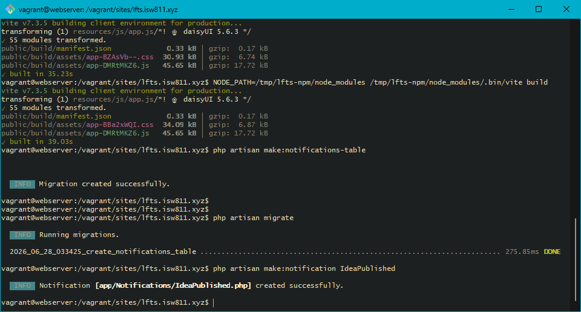
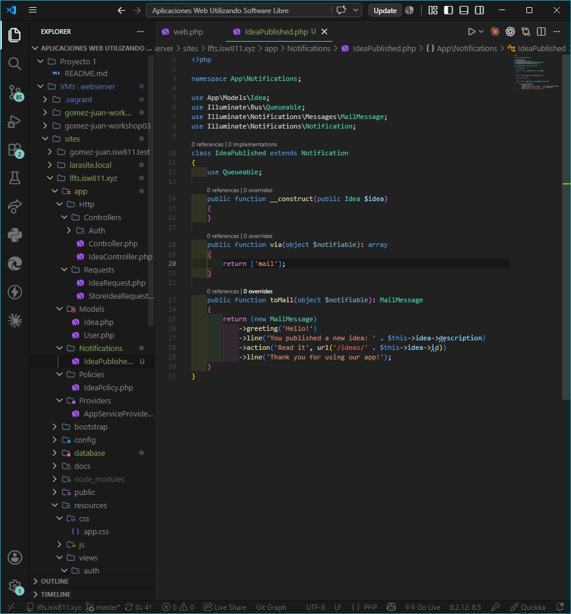
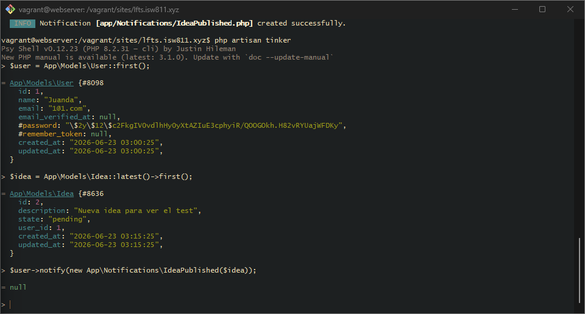
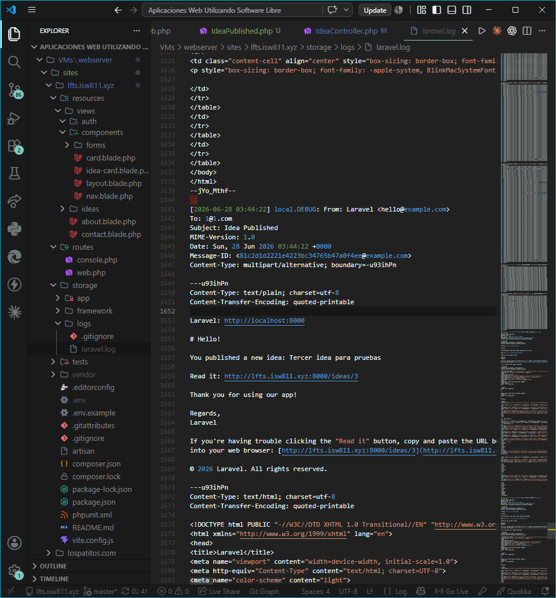

## Episodio 20: Notifications

### Resumen
Se aprende a usar el sistema de **Notifications** de Laravel. Se crea la tabla
de notificaciones con `make:notifications-table`, se genera la clase
`IdeaPublished` que envía un email al usuario cuando publica una nueva idea,
y se conecta al método `store` del `IdeaController`. El email se entrega por
el driver `mail` y se verifica en los logs de Laravel durante el desarrollo.
Mailpit es una herramienta opcional para visualizar los emails en una interfaz
gráfica, pero no es necesaria para el funcionamiento de las notificaciones.

### Comandos utilizados
```bash
php artisan make:notifications-table
php artisan migrate
php artisan make:notification IdeaPublished
php artisan tinker
# $user = App\Models\User::first();
# $idea = App\Models\Idea::latest()->first();
# $user->notify(new App\Notifications\IdeaPublished($idea));
```

### Archivos modificados
- `app/Notifications/IdeaPublished.php`
- `app/Http/Controllers/IdeaController.php`
- `database/migrations/xxxx_create_notifications_table.php`

### Evidencia





### Comentarios
El trait `Notifiable` en el modelo User permite usar el metodo `notify()`.
Por defecto en desarrollo los emails se registran en `storage/logs/laravel.log`.
En produccion se puede configurar SMTP, Postmark u otro proveedor en el `.env`.
Para no hacer esperar al usuario, las notificaciones pueden enviarse en cola
implementando la interfaz `ShouldQueue`.
Mailpit es una herramienta grafica opcional para visualizar emails durante
el desarrollo, pero el log de Laravel es suficiente para verificar el envio.