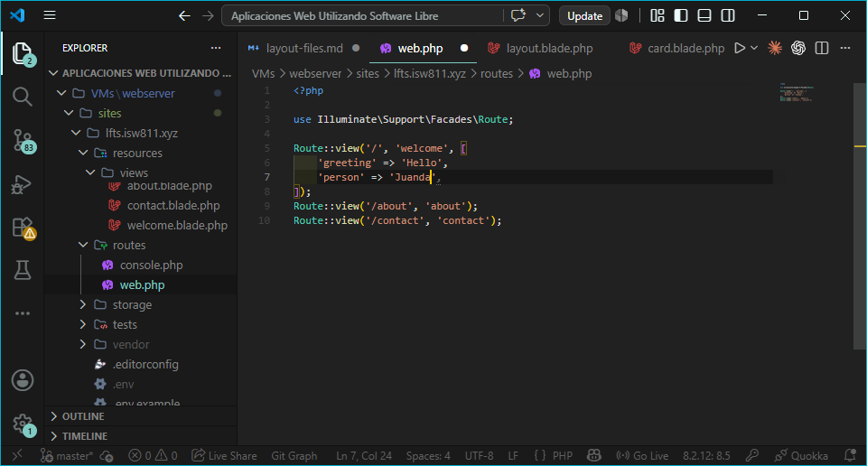
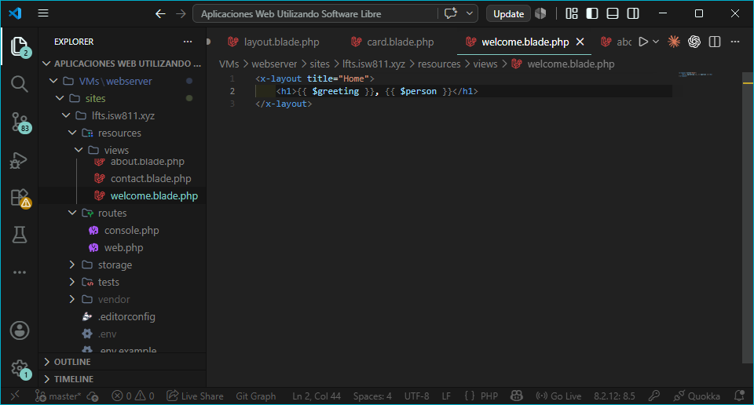
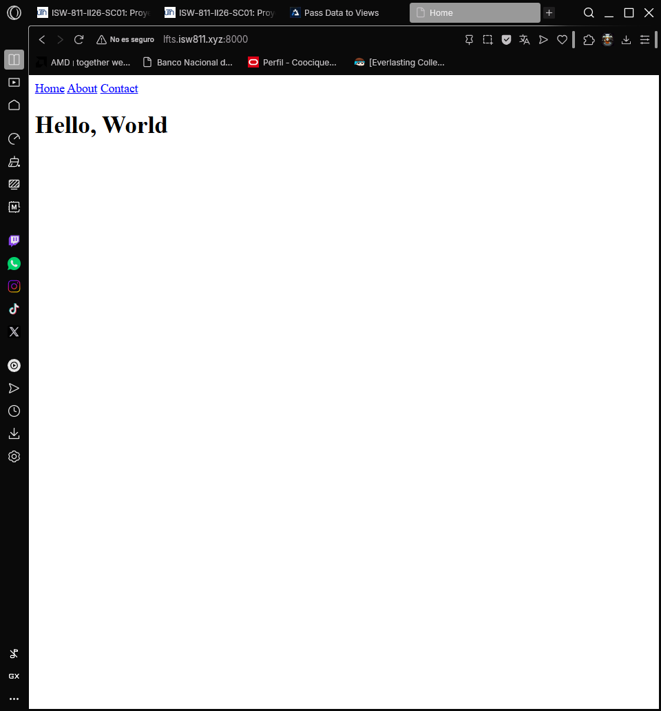
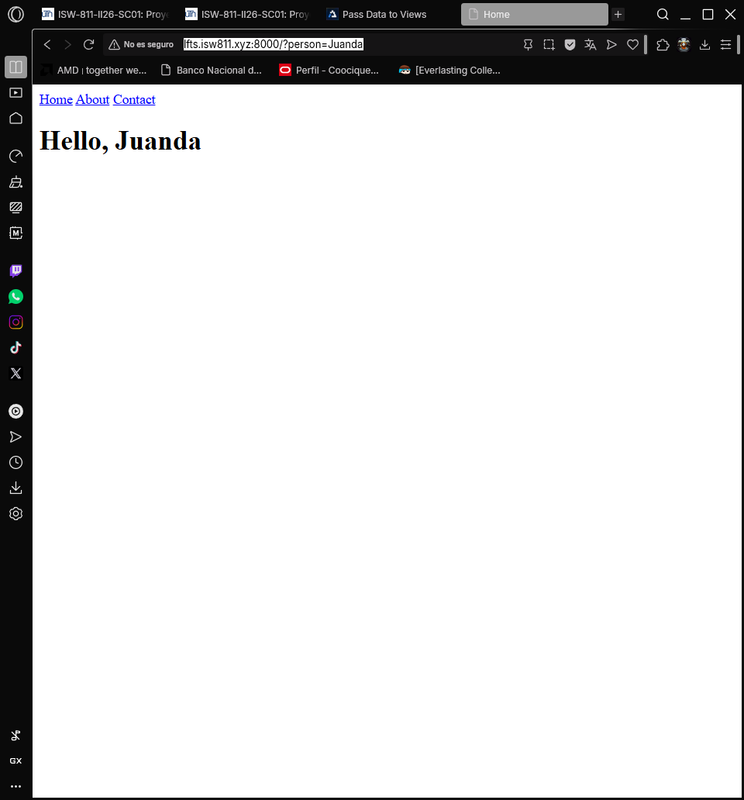

## Episodio 05: Pass Data to Views

### Resumen
En este episodio aprendí cómo pasar datos desde las rutas hacia las vistas en Laravel.
Se explicó cómo enviar variables a través del array de datos, cómo leer parámetros del 
query string y cómo Blade protege automáticamente contra ataques XSS.

### Actividades realizadas
- Pasé datos a la vista usando `Route::view()` con un array como tercer parámetro.
- Mostré las variables en la vista usando la sintaxis `{{ }}` de Blade.
- Leí datos desde el query string usando `request()`.
- Configuré un valor por defecto cuando no se pasa el parámetro.
- Comprendí la diferencia entre `{{ }}` y `{!! !!}` en cuanto a seguridad.

### Comandos y código relevante

Pasar datos con Route::view():
```php
Route::view('/', 'welcome', [
    'greeting' => 'Hello',
    'person' => 'Juanda'
]);
```

Leer desde el query string con valor por defecto:
```php
Route::get('/', function () {
    return view('welcome', [
        'greeting' => 'Hello',
        'person' => request('person', 'World')
    ]);
});
```

Mostrar datos en la vista:
```html
<x-layout title="Home">
    <h1>{{ $greeting }}, {{ $person }}</h1>
</x-layout>
```

### Archivos modificados
- `routes/web.php`
- `resources/views/welcome.blade.php`

### Lo que aprendí
- Se pueden pasar datos a una vista enviando un array como parámetro.
- Cada clave del array se convierte en una variable disponible en la vista.
- `request('key', 'default')` permite leer el query string con un valor por defecto.
- Blade escapa automáticamente los datos con `{{ }}` para prevenir XSS.
- Con `{!! !!}` se puede mostrar HTML sin escapar, solo cuando se confía en los datos.

### Evidencia



