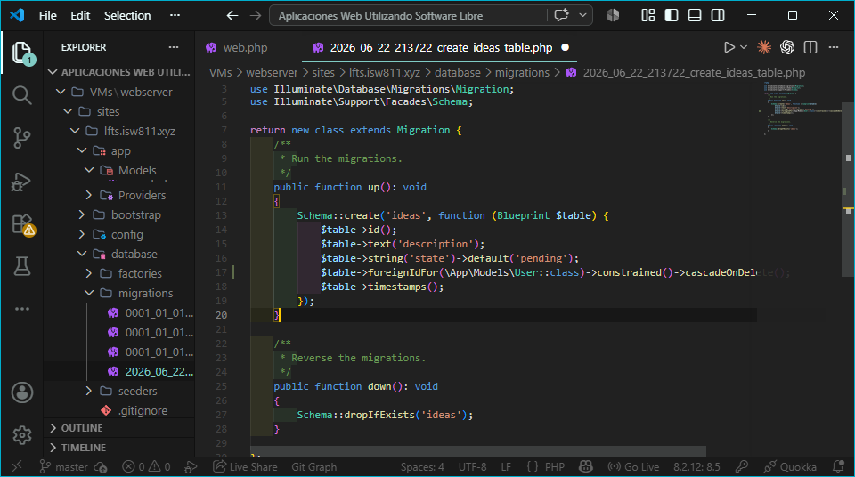
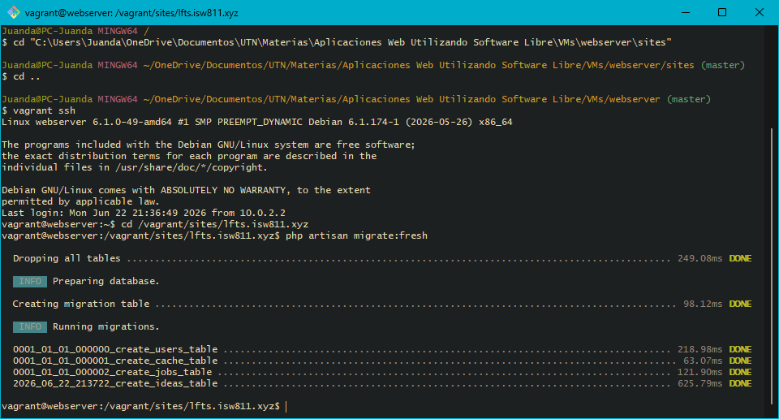
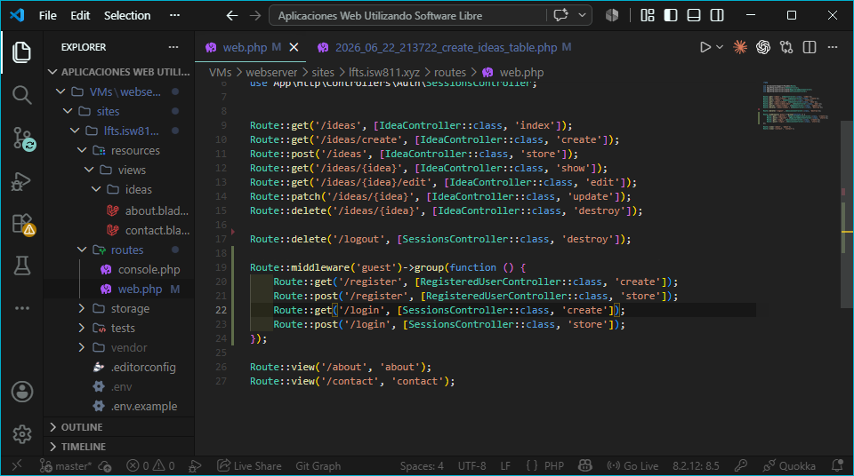
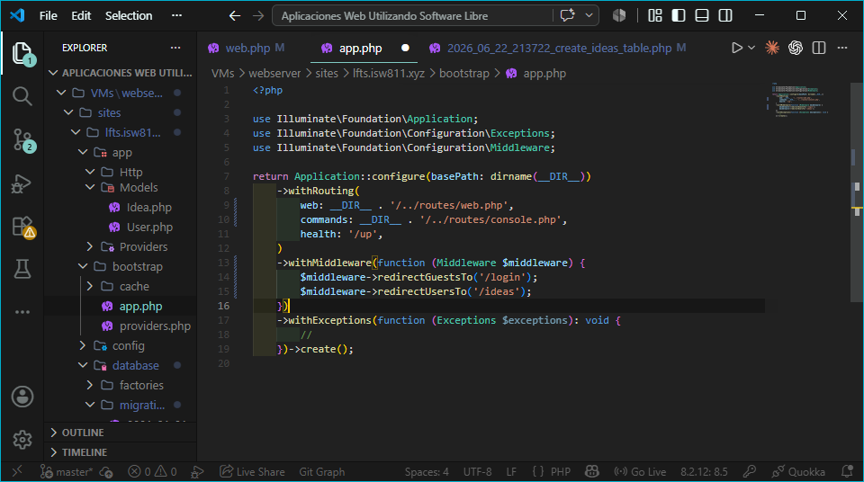
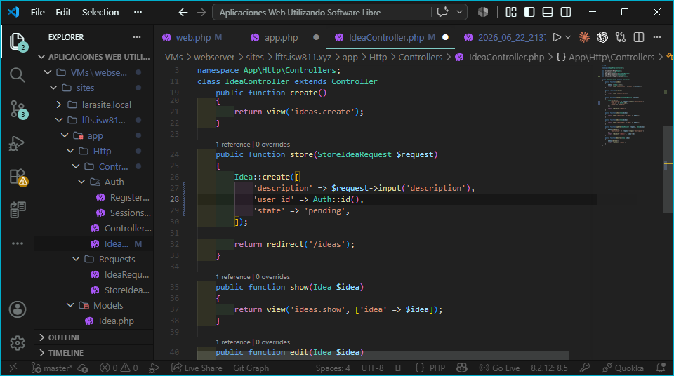
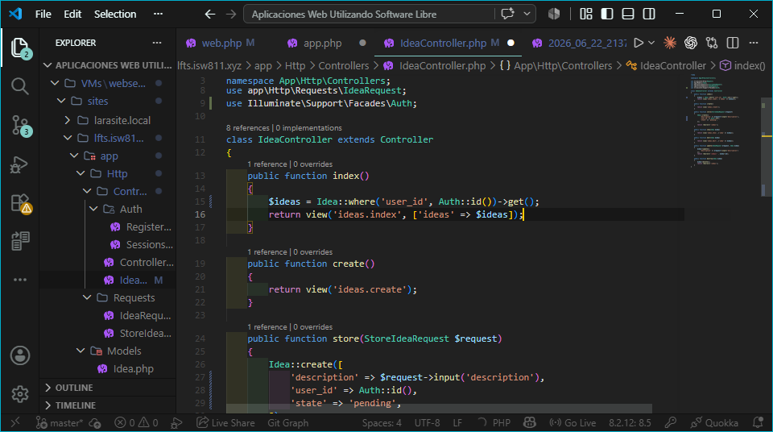

### Archivos modificados
- database/migrations/2026_06_22_213722_create_ideas_table.php
- bootstrap/app.php
- routes/web.php
- app/Http/Controllers/IdeaController.php

### Evidencia

### Comentarios
Se comprendió el uso de middleware para proteger rutas y la diferencia entre
rutas de tipo auth y guest. Se aprendió a asociar registros a usuarios mediante
foreignIdFor y a filtrar consultas con where() para garantizar privacidad de datos.