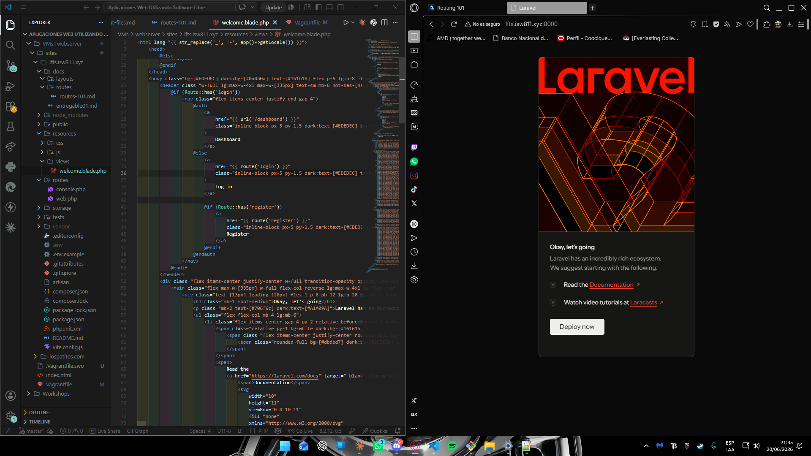
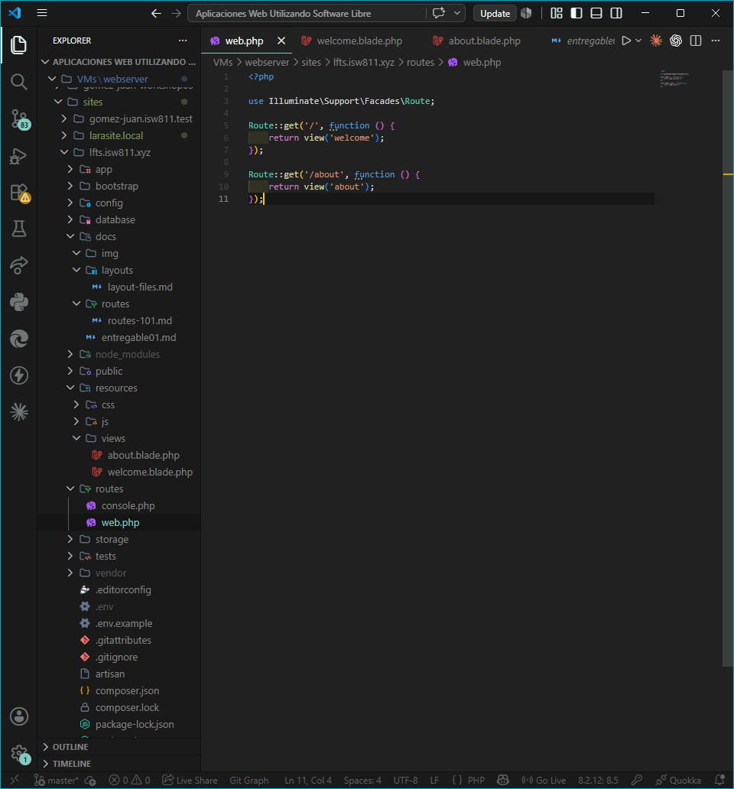
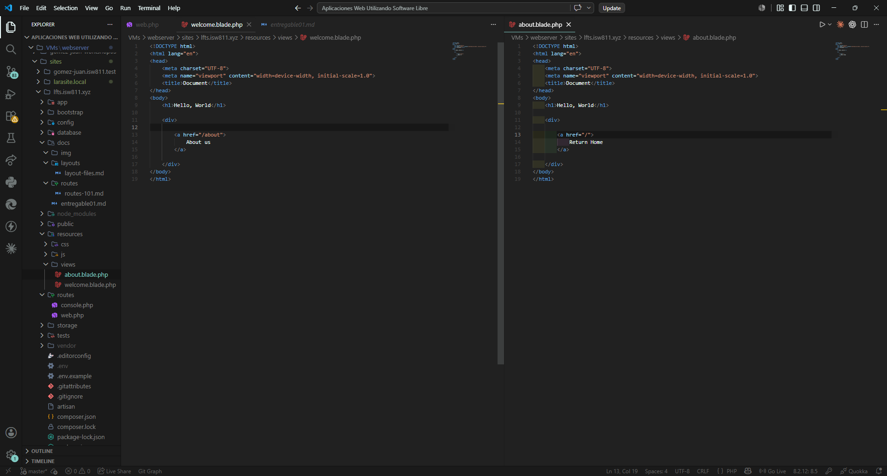

## Episodio 03: Routing 101

### Resumen
En este episodio aprendí cómo funcionan las rutas en Laravel. Se explicó la sintaxis 
básica de `Route::get()` y cómo relacionar una URL con una vista. También se mostró 
dónde se encuentran las vistas dentro del proyecto y cómo crear nuevas páginas.

### Actividades realizadas
- Revisé la ruta principal definida en `routes/web.php`.
- Analicé la sintaxis de `Route::get()`.
- Modifiqué el contenido de la vista `welcome.blade.php`.
- Creé una ruta para la página About.
- Creé la vista `about.blade.php`.
- Agregué enlaces para navegar entre páginas.

### Comandos y código relevante

Ruta principal:
```php
Route::get('/', function () {
    return view('welcome');
});
```

Ruta para About:
```php
Route::get('/about', function () {
    return view('about');
});
```

### Archivos modificados
- `routes/web.php`
- `resources/views/welcome.blade.php`
- `resources/views/about.blade.php`

### Lo que aprendí
- Las rutas se definen en el archivo `routes/web.php`.
- El método `Route::get()` permite responder a solicitudes GET.
- Las vistas se almacenan en la carpeta `resources/views`.
- Cada ruta se conecta con una vista mediante el método `view()`.
- Se pueden agregar enlaces entre páginas usando etiquetas `<a href="">`.

### Evidencia


