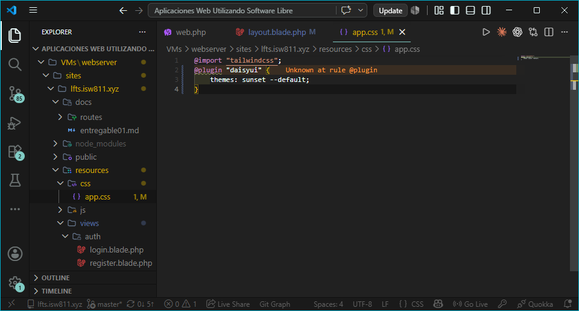
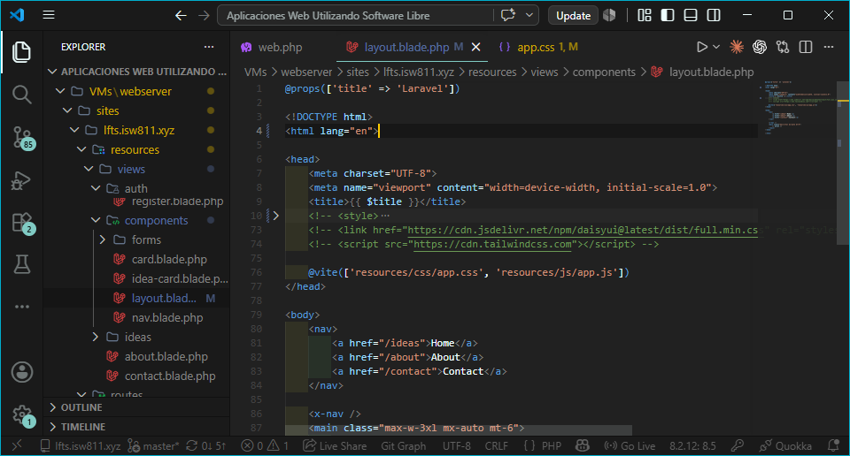
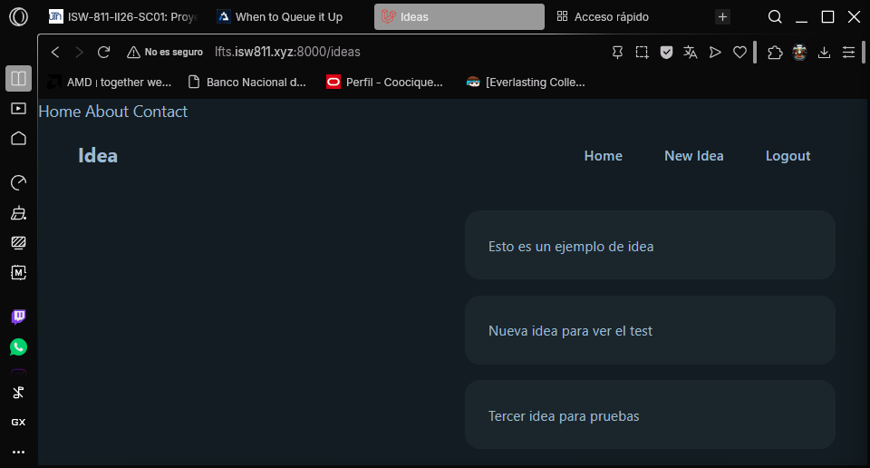
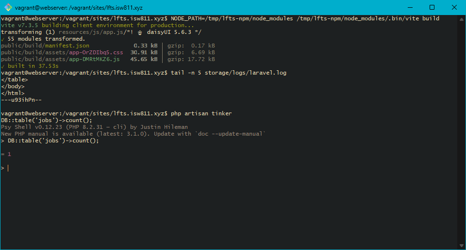
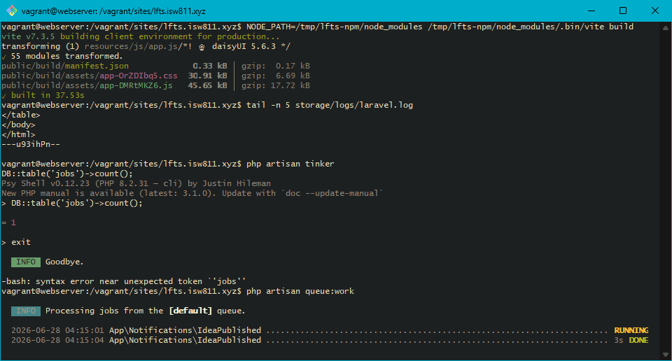

## Episodio 21: When to Queue it Up

### Resumen
Se aprende a usar **queued jobs** en Laravel para mejorar el rendimiento.
Se implementa la interfaz `ShouldQueue` en `IdeaPublished` para que el email
se envíe en segundo plano sin hacer esperar al usuario. Se explica la
diferencia entre Job (tarea), Worker (ejecutor) y Queue (contenedor de tareas).
Se crea un job de ejemplo `UpdateIdeaStatistics` y se verifica su procesamiento
con `php artisan queue:work`. También se cambia el tema de DaisyUI a Sunset.

### Comandos utilizados
```bash
php artisan queue:work
php artisan make:job UpdateIdeaStatistics
php artisan tinker
# App\Jobs\UpdateIdeaStatistics::dispatch();
# DB::table('jobs')->count();

# Build de assets
NODE_PATH=/tmp/lfts-npm/node_modules /tmp/lfts-npm/node_modules/.bin/vite build
```

### Archivos modificados
- `resources/css/app.css`
- `resources/views/components/layout.blade.php`
- `app/Notifications/IdeaPublished.php`
- `app/Jobs/UpdateIdeaStatistics.php`
- `.env`

### Evidencia






### Comentarios
Implementar ShouldQueue en una notificacion hace que Laravel la despache
como un job en lugar de procesarla de forma sincrona. Sin un worker activo
los jobs quedan en la tabla jobs sin procesarse. En produccion se configuran
workers persistentes usando herramientas como Laravel Forge o Supervisor.
El driver sync en QUEUE_CONNECTION procesa los jobs de forma sincrona
(sin cola), util solo para desarrollo rapido o pruebas.